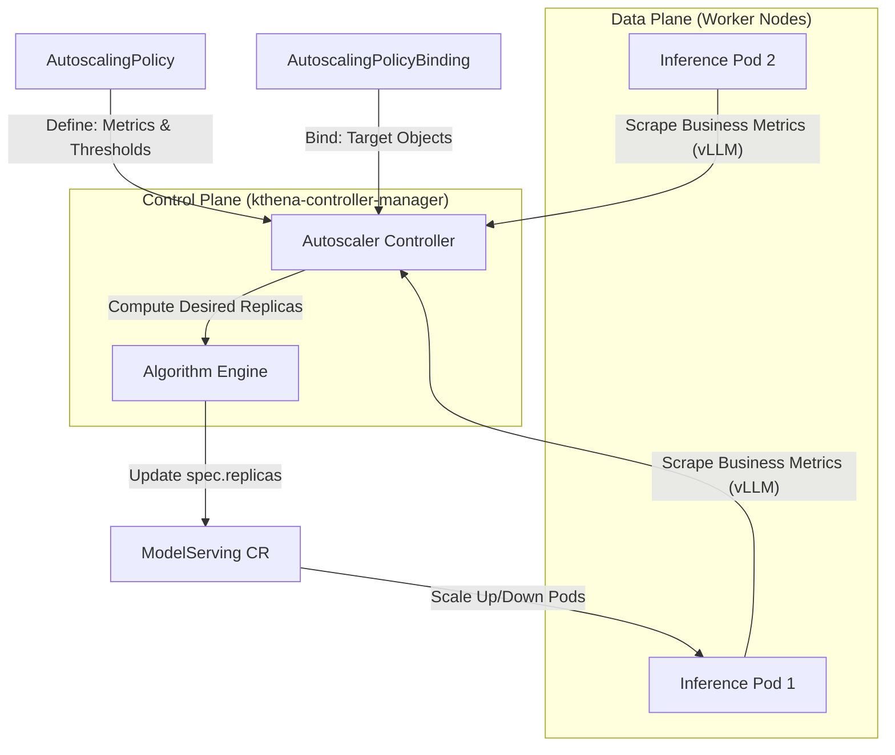

# A Deep Dive into the Kthena Autoscaler

> *Author: Kthena Community*  
> *Published: 2026*  
> *Tags: #Autoscaling #Kubernetes #LLM #CloudNative #Volcano*

---

As Large Language Models (LLMs) become increasingly central to modern AI applications, the infrastructure supporting them must evolve. While intelligent routing and model orchestration address *where* requests go, a critical question remains: **how many inference instances should be running at any given moment?**

Enter **Kthena Autoscaler** — built into **kthena-controller-manager**, it runs as a core controller in Kubernetes environments and dynamically adjusts the number of deployed serving instances based on real-time load. It maintains healthy business metrics (such as SLO indicators) while optimizing computational resource consumption.

In this post, we'll take a deep dive into the architecture, generic policy logic, and diverse binding forms of the Kthena Autoscaler.

---

## 1. Why Autoscaling Matters for LLM Inference

LLM inference workloads exhibit unique characteristics that challenge traditional autoscaling approaches:

| Characteristic | Impact on Scaling |
|---------------|----------------|
| **Business-Metric Driven** | Business metrics like **queue length** and **KV cache utilization** from engines (e.g., vLLM) reflect service saturation more accurately than CPU/Mem usage. |
| **Bursty Traffic Patterns** | Sudden spikes in user requests require rapid scale-up to maintain latency SLOs |
| **Prefill/Decode Asymmetry** | PD-disaggregated deployments need independent and flexible scaling for prefill and decode roles. |
| **Heterogeneous Hardware & Cost** | Different instance types (GPU/NPU) offer varying performance/cost tradeoffs, requiring refined scheduling. |

Traditional Kubernetes HPA or KEDA lack the **model-awareness** needed for LLM workloads. Kthena Autoscaler bridges this gap through **Direct Pod Metric Scraping**, **Role-Level Scaling support**, and **Cost-Aware Optimization Algorithms**.

---

## 2. Architecture Overview

Kthena Autoscaler follows a controller pattern, running as a sub-controller within `kthena-controller-manager`. It creates a closed-loop control system by scraping business metrics directly from Pods and applying user-defined policies.



---

## 3. Generic Strategy (AutoscalingPolicy): Defining the "How"

**AutoscalingPolicy** is a reusable logic template that defines the core brain for calculating replica demand.

### 3.1 Core Metrics and Tolerance
The Autoscaler scrapes **inference-specific metrics** directly from the Pod's `/metrics` endpoint. This allows it to perceive vLLM's internal request queue state. Key metrics include:
- `vllm:num_requests_waiting`: Waiting queue length (the most critical indicator).
- `vllm:gpu_cache_usage_perc`: KV cache utilization.

The `targetValue` sets the goal, while `tolerancePercent` creates a "dead band" to prevent frequent adjustments near the target.

### 3.2 Scaling Behavior: Stable and Panic Modes
To handle LLM traffic patterns, the Policy supports a dual-mode strategy:
- **Stable Mode**: Uses a longer **stabilization window** (e.g., 1 minute) to observe sustained trends, preventing overreaction to transient spikes.
- **Panic Mode**: Triggered when metrics deviate significantly (e.g., exceeding 150% of target). It bypasses the stabilization window for rapid, second-level scale-up.

### 3.3 Cost-Aware Optimization Algorithm
When scaling across multiple instance types or hardware, the underlying algorithm engine executes a **greedy algorithm with doubling strategy**.

The algorithm divides capacity into exponential batches (based on `costExpansionRate`) according to the **Unit Cost** of each instance type, sorting them by ascending cost. This ensures:
1. **Cost Efficiency**: Lower-cost instances are prioritized.
2. **Cold-Start Reduction**: The sequence remains stable across cycles, prioritizing the reuse of already-running instances.

---

## 4. Scaling Binding (AutoscalingPolicyBinding): Defining the "What"

**AutoscalingPolicyBinding** acts as the "glue" connecting a generic strategy to specific targets. Different binding targets result in completely different scaling forms.

### 4.1 ServingGroup Binding: Fixed PD Ratio Scaling
This is the most common form. The Policy is bound to a `ModelServing` or a specific `ServingGroup` within it.
- **Logic**: The Autoscaler treats the entire group as a single unit.
- **Effect**: The system strictly maintains the defined Role ratios (e.g., prefill:decode = 1:2) during scaling. This is ideal for standard deployments with fixed PD topologies.

```yaml
# Binding to ModelServing (Whole group synchronous scaling)
apiVersion: workload.serving.volcano.sh/v1alpha1
kind: AutoscalingPolicyBinding
metadata:
  name: vllm-group-binding
spec:
  policyRef:
    name: vllm-queue-policy
  homogeneousTarget:
    target:
      targetRef:
        kind: ModelServing
        name: vllm-llama3
    minReplicas: 1
    maxReplicas: 10
```

### 4.2 Role Binding: Heterogeneous PD Scaling
The Policy is bound to a specific `Role` (e.g., `decode` only) within a `ModelServing`.
- **Logic**: The Autoscaler calculates and modifies replicas only for that specific role.
- **Effect**: Prefill replicas can remain stable while decode replicas increase independently based on output load. This **Heterogeneous PD Scaling** significantly improves resource utilization.

```yaml
# Example of ModelServing with Role definitions
apiVersion: workload.serving.volcano.sh/v1alpha1
kind: ModelServing
metadata:
  name: deepseek-serving
spec:
  template:
    roles:
    - name: prefill
      replicas: 1
      # ... container config ...
    - name: decode
      replicas: 2
      # ... container config ...
---
# Example of independent Role binding
apiVersion: workload.serving.volcano.sh/v1alpha1
kind: AutoscalingPolicyBinding
metadata:
  name: decode-independent-binding
spec:
  policyRef:
    name: llm-scaling-policy
  homogeneousTarget:
    target:
      targetRef:
        kind: ModelServing
        name: deepseek-serving
      subTargets:
        kind: Role
        name: decode  # Independent scaling for the decode role
    minReplicas: 2
    maxReplicas: 8
```

### 4.3 Heterogeneous Target Binding: Cross-Hardware Cost Optimization
When the binding includes the `heterogeneousTarget` field, multiple `ModelServing` targets with different costs can be defined.
- **Logic**: The algorithm engine considers the replica counts and costs of all targets to compute the optimal combination.
- **Effect**: In hybrid clusters, the Autoscaler automatically distributes inference instances across A100, H100, or NPUs based on cost priority.

```yaml
# Cross-hardware heterogeneous target binding example
apiVersion: workload.serving.volcano.sh/v1alpha1
kind: AutoscalingPolicyBinding
metadata:
  name: heterogeneous-cost-binding
spec:
  policyRef:
    name: vllm-queue-policy
  heterogeneousTarget:
    params:
    - target:
        targetRef: { kind: ModelServing, name: deepseek-h100 }
      cost: 100
      minReplicas: 1
      maxReplicas: 10
    - target:
        targetRef: { kind: ModelServing, name: deepseek-a100 }
      cost: 50
      minReplicas: 1
      maxReplicas: 20
```

---

## 5. Practical Usage: Scaling a vLLM Service

### Step 1: Create a Generic AutoscalingPolicy
```yaml
apiVersion: workload.serving.volcano.sh/v1alpha1
kind: AutoscalingPolicy
metadata:
  name: vllm-queue-policy
spec:
  metrics:
  - metricName: vllm:num_requests_waiting
    targetValue: 5.0
  tolerancePercent: 10
  behavior:
    scaleUp:
      stablePolicy: { stabilizationWindow: 30s }
    scaleDown:
      stablePolicy: { stabilizationWindow: 5m }
```

### Step 2: Choose Scaling Form via Binding
For **Fixed-Ratio PD Scaling**, bind to the ServingGroup (default):
```yaml
apiVersion: workload.serving.volcano.sh/v1alpha1
kind: AutoscalingPolicyBinding
metadata:
  name: vllm-group-binding
spec:
  policyRef:
    name: vllm-queue-policy
  homogeneousTarget:
    target:
      targetRef: { kind: ModelServing, name: vllm-llama3 }
    minReplicas: 1
    maxReplicas: 10
```

For **Heterogeneous PD Scaling**, bind to the specific Role.

---

## 6. Best Practices and Troubleshooting

### Configuration Guidelines
1. **Start Conservative**: Begin with wider tolerance bands (15-20%) and longer stabilization windows.
2. **Role-Specific Targets**: In heterogeneous scenarios, set more sensitive thresholds for the decode role than prefill.
3. **Cost Calibration**: Adjust `cost` values based on actual cloud pricing or TCO for heterogeneous scaling.

### Observability
Kthena Autoscaler exposes metrics at `/metrics`:
- `kthena_autoscaler_desired_replicas`: Target replicas after decision.
- `kthena_autoscaler_current_replicas`: Actual observed replicas.
- `kthena_autoscaler_scaling_events_total`: Scaling action counter.

---

## 7. Advanced: Cost-Aware Optimization and Heterogeneous Scaling Example

In production, we often have different GPU SKUs. The `heterogeneousTarget` in Kthena Autoscaler allows for cost-prioritized scaling across multiple targets.

```yaml
# Cross-hardware cost optimization binding example
apiVersion: workload.serving.volcano.sh/v1alpha1
kind: AutoscalingPolicyBinding
metadata:
  name: heterogeneous-cost-binding
spec:
  policyRef:
    name: vllm-queue-policy
  heterogeneousTarget:
    params:
    - target:
        targetRef:
          kind: ModelServing
          name: deepseek-h100  # High performance, high cost
      cost: 100
      minReplicas: 1
      maxReplicas: 10
    - target:
        targetRef:
          kind: ModelServing
          name: deepseek-a100  # Lower cost, preferred for scaling
      cost: 50
      minReplicas: 1
      maxReplicas: 20
    # Defines the expansion rate for cost-based greedy allocation
    costExpansionRatePercent: 200
```

By configuring different `cost` values, the Autoscaler's algorithm engine prioritizes scaling on lower-cost resources while maintaining high-efficiency instances when scaling down, achieving the best TCO while meeting performance requirements.

---

## Conclusion

Kthena Autoscaler provides immense flexibility by decoupling scaling logic (Policy) from scaling targets (Binding). ServingGroup binding enables stable **fixed-ratio scaling**, while Role binding allows for fine-grained **heterogeneous scaling**. Combined with its integrated controller architecture and cost-aware algorithm, it forms a robust foundation for building efficient, low-cost LLM inference platforms.

🔗 [Kthena Documentation](https://kthena.volcano.sh)  
🔗 [GitHub Repository](https://github.com/volcano-sh/kthena)
