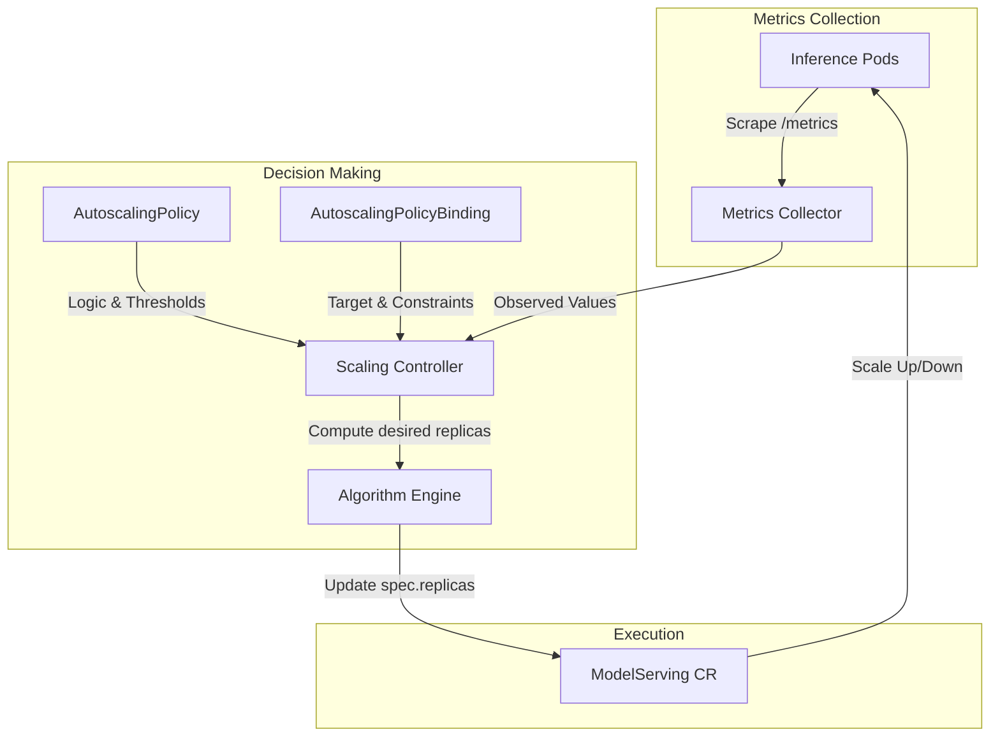

# A Deep Dive into the Kthena Autoscaler

> *Author: Kthena Community*  
> *Published: 2026*  
> *Tags: #Autoscaling #Kubernetes #LLM #CloudNative #Volcano*

---

As Large Language Models (LLMs) become increasingly central to modern AI applications, the infrastructure supporting them must evolve to meet demanding performance, scalability, and cost requirements. While intelligent routing and model orchestration address *where* requests go, a critical question remains: **how many inference instances should be running at any given moment?**

Enter **Kthena Autoscaler** — an optional component of the Kthena system that runs in Kubernetes environments and dynamically adjusts the number of deployed serving instances based on real-time load [[1]]. It maintains healthy business metrics (such as SLO indicators) while optimizing computational resource consumption, ensuring your LLM serving infrastructure is both responsive and cost-efficient.

In this post, we'll take a deep dive into the architecture, algorithms, and practical usage of Kthena Autoscaler, exploring how it enables intelligent, model-aware elastic scaling for production LLM workloads.

---

## 1. Why Autoscaling Matters for LLM Inference

LLM inference workloads exhibit unique characteristics that challenge traditional autoscaling approaches:

| Characteristic | Impact on Scaling |
|---------------|----------------|
| **Bursty Traffic Patterns** | Sudden spikes in user requests require rapid scale-up to maintain latency SLOs |
| **High Resource Consumption** | Each inference instance consumes significant GPU/NPU resources; over-provisioning is costly |
| **Prefill/Decode Asymmetry** | PD-disaggregated deployments need independent scaling for prefill and decode roles [[34]] |
| **Cold Start Overhead** | Loading large models into memory takes seconds to minutes; scaling decisions must account for this latency |
| **Heterogeneous Hardware** | Different instance types (GPU/NPU, different generations) offer varying performance/cost tradeoffs |

Traditional Kubernetes Horizontal Pod Autoscaler (HPA) or KEDA, while powerful, lack the model-awareness needed to make intelligent scaling decisions for LLM workloads. Kthena Autoscaler bridges this gap by:

- Collecting **inference-specific metrics** (queue length, KV cache utilization, TTFT/TPOT latency)
- Supporting **role-level scaling** for PD-disaggregated architectures
- Implementing **cost-aware optimization** across heterogeneous instance types
- Providing **panic mode** for rapid response to traffic spikes

---

## 2. Architecture Overview

Kthena Autoscaler follows a controller pattern consistent with Kubernetes design principles. The logical flow from metric collection to replica modification is illustrated below:



### Core Components

1. **Metrics Collector**: The Autoscaler relies on **business-level metrics** exposed by the inference pods themselves. It periodically scrapes runtime metrics from the engine's `/metrics` endpoint. For autoscaling to work, the pods **must** expose these metrics in a Prometheus-compatible format (e.g., vLLM's built-in metrics). Key metrics typically include:
   - `kthena:num_requests_waiting` (or `vllm:num_requests_waiting`): Queue length
   - `kthena:kv_cache_usage_perc`: KV cache utilization
   - `kthena:time_to_first_token`: TTFT latency

2. **Scaling Controller**: Implements the core autoscaling logic by comparing observed metrics against targets and updating the `ModelServing` replicas.

3. **Algorithm Engine**: Supports both **Homogeneous** (single instance type) and **Heterogeneous** (cost-aware multi-instance) scaling modes.

### Policy vs. Binding: The Core Abstractions

Kthena separates "how to scale" from "what to scale" using two primary Custom Resources:

- **AutoscalingPolicy**: A reusable template defining the **scaling logic**. It specifies which metrics to watch, the `targetValue` for those metrics, and the `behavior` (stable/panic modes, stabilization windows).
- **AutoscalingPolicyBinding**: The "glue" that specifies the **scaling target**. It links an `AutoscalingPolicy` to a specific `ModelServing` (or a `Role`). It also defines operational constraints like `minReplicas`, `maxReplicas`, and the `metricEndpoint` for scraping.

---

## 3. Homogeneous Scaling: Stable and Panic Modes

For deployments with a single instance type (e.g., all vLLM pods on A100 GPUs), Kthena Autoscaler implements a dual-mode strategy:

### Stable Mode
- Uses a **stabilization window** (e.g., 1 minute) to observe sustained load before scaling
- Prevents overreaction to transient spikes
- Evaluates metrics at configurable `period` intervals (e.g., 30s)

### Panic Mode
- Triggered when metrics exceed `panicThresholdPercent` (e.g., 150% of target)
- Bypasses stabilization window for rapid scale-up
- Maintains panic state for `panicModeHold` duration (e.g., 5 minutes) to handle sustained spikes

```yaml
# AutoscalingPolicy example
apiVersion: workload.serving.volcano.sh/v1alpha1
kind: AutoscalingPolicy
metadata:
  name: llm-scaling-policy
spec:
  metrics:
  - metricName: kthena:num_requests_waiting
    targetValue: 10.0  # Target: ≤10 waiting requests per instance
  tolerancePercent: 10  # ±10% tolerance band
  behavior:
    scaleUp:
      panicPolicy:
        panicThresholdPercent: 150  # Enter panic at 15 requests
        panicModeHold: 5m
      stablePolicy:
        stabilizationWindow: 1m
        period: 30s
    scaleDown:
      stabilizationWindow: 5m  # Longer window for scale-down stability
      period: 1m
```

#### Field Explanations

| Field | Description |
|-------|-------------|
| `metricName` | The name of the metric to monitor, scraped from the inference pod's `/metrics` endpoint. |
| `targetValue` | The desired average value for the metric per instance. If average value > `targetValue`, it scales up. |
| `tolerancePercent` | The allowed fluctuation range around `targetValue` (e.g., 10% means no scaling if the metric is between 9.0 and 11.0). |
| `behavior` | Root field for defining specific scaling behaviors for scale-up and scale-down. |
| `scaleUp.panicPolicy` | Configures "Panic Mode" to bypass stabilization windows during extreme traffic spikes. |
| `panicThresholdPercent` | Threshold to trigger Panic Mode. 150% means if the metric reaches 15.0 (10.0 * 1.5), the stabilization window is ignored. |
| `panicModeHold` | The minimum duration to remain in Panic Mode to prevent premature scale-down during oscillating spikes. |
| `scaleUp.stablePolicy` | Configuration for standard, "cautious" scaling based on sustained trends. |
| `stabilizationWindow` | The look-back duration. For `scaleUp`, it ensures the load is consistently high for 1m before adding replicas. |
| `period` | The frequency at which the Autoscaler evaluates the metric and makes a decision. |
| `scaleDown` | Configuration for scale-down events, typically using a longer `stabilizationWindow` to avoid frequent pod restarts. |

### Role-Level Scaling for PD-Disaggregation

A key differentiator is support for **role-level scaling** within a single `ModelServing` CRD. In PD-disaggregated deployments, prefill and decode roles have different resource profiles and scaling requirements [[34]]:

```yaml
apiVersion: workload.serving.volcano.sh/v1alpha1
kind: AutoscalingPolicyBinding
metadata:
  name: pd-role-binding
spec:
  policyRef:
    name: llm-scaling-policy
  homogeneousTarget:
    target:
      targetRef:
        kind: ModelServing
        name: deepseek-serving
      subTargets:
        kind: Role
        name: decode  # Scale only the decode role
    minReplicas: 2
    maxReplicas: 8
```

#### Field Explanations

| Field | Description |
|-------|-------------|
| `policyRef` | Reference to the `AutoscalingPolicy` that contains the scaling logic (metrics, thresholds, etc.). |
| `homogeneousTarget` | Used when scaling a single instance type. Contains the target identification and scaling constraints. |
| `targetRef` | Identifies the top-level resource to be scaled (e.g., a `ModelServing` CR). |
| `subTargets` | Optional. Allows fine-grained scaling of a specific component within the target. |
| `subTargets.kind` | The type of sub-target. In Kthena, `Role` is used to target specific PD-disaggregated roles. |
| `subTargets.name` | The name of the specific role (e.g., `decode`) defined in the `ModelServing` spec. |
| `minReplicas` | The minimum number of replicas allowed for this specific target/role. |
| `maxReplicas` | The maximum number of replicas allowed for this specific target/role. |

This enables fine-grained optimization: scale up decode replicas for long-output scenarios while keeping prefill replicas stable.

---

## 4. Heterogeneous Scaling: Cost-Aware Optimization

For advanced deployments with multiple instance types (e.g., mixing A100 and H100 GPUs, or GPU/NPU heterogeneous clusters), Kthena Autoscaler implements a sophisticated **cost-aware optimization algorithm**.

### The Problem

Given:
- N instance types with different costs (`c_i`) and performance characteristics
- A predicted total instance demand `K` from metric-based forecasting
- Min/max replica constraints per instance type

Find the optimal combination of instances that:
1. Meets the total demand `K`
2. Minimizes total cost
3. Respects cold-start overhead by reusing already-running instances

### The Algorithm: Greedy with Doubling Strategy

Kthena employs a **greedy algorithm with exponential batching** [[40]][[41]]:

1. **Calculate Capacity**: For each instance type `i`, compute available capacity `C_i = maxReplicas_i - minReplicas_i`

2. **Generate Batches**: Using `costExpansionRate` (default 200%), divide capacity into exponentially-sized batches:
   ```
   Batch sizes: P^0, P^1, P^2, ... where P = costExpansionRate
   ```

3. **Cost-Sort Batches**: Mix batches from all instance types and sort by ascending cost-per-instance

4. **Build Scaling Sequence**: Expand sorted batches into a linear sequence `seq` of instance additions

5. **Select Top-K**: When prediction requires `K` additional instances, take the first `K` entries from `seq`

The mathematical formulation:
```
seq = sorted( ⋃_{i=1}^{N} { P^k · c_i | k ∈ (0,1,...,M_i) } ∪ { (C_i - Σ_{k=0}^{M_i} P^k) · c_i } )
```

Where:
- `N`: Number of instance types
- `P`: costExpansionRate
- `c_i`: Cost of instance type `i`
- `M_i`: Number of explicit power terms for type `i`
- `C_i`: Total capacity for type `i`

### Why This Works

- **Cost Efficiency**: Lower-cost instances are prioritized when performance permits
- **Cold-Start Reduction**: The sequence preserves instance ordering across scaling cycles, maximizing reuse of already-running pods
- **Flexibility**: `costExpansionRate` allows tuning the tradeoff between cost optimization and selection flexibility

### Configuration Example

```yaml
apiVersion: workload.serving.volcano.sh/v1alpha1
kind: AutoscalingPolicyBinding
metadata:
  name: heterogeneous-binding
spec:
  policyRef:
    name: llm-scaling-policy
  heterogeneousTarget:
    costExpansionRatePercent: 20  # Allow 20% cost premium for better performance
    params:
    - target:
        targetRef:
          kind: ModelServing
          name: h100-serving  # High-performance, high-cost
      minReplicas: 1
      maxReplicas: 4
      cost: 100  # Relative cost unit
    - target:
        targetRef:
          kind: ModelServing
          name: a100-serving  # Balanced performance/cost
      minReplicas: 2
      maxReplicas: 8
      cost: 60
    - target:
        targetRef:
          kind: ModelServing
          name: ascend-serving  # Cost-optimized NPU
      minReplicas: 0
      maxReplicas: 10
      cost: 30
```

---

## 5. Integration with ModelServing and Volcano

Kthena Autoscaler doesn't operate in isolation. It integrates tightly with:

### ModelServing CRD
- Autoscaler watches `ModelServing` resources and updates `spec.replicas` or role-level `replicas` fields
- Supports the three-tier architecture (`ModelServing → ServingGroup → Role`) for complex deployment patterns [[27]]

### Volcano Gang Scheduling
- When scaling up, new pods are created with `PodGroup` labels
- Volcano scheduler ensures all-or-nothing scheduling for gang-aware deployments
- Prevents partial scaling that could break inference workflows

### Metrics Pipeline
```
Inference Pod (vLLM/SGLang/TGI)
         │
         ▼
   /metrics endpoint
         │
         ▼
Autoscaler Metrics Collector
         │
         ▼
   Prometheus-compatible format
         │
         ▼
Scaling Decision Engine
```

Custom metric endpoints can be configured via `metricEndpoint` in the binding:
```yaml
metricEndpoint:
  uri: "/custom-metrics"
  port: 9090
  labelSelector:
    matchLabels:
      inference-role: prefill
```

---

## 6. Practical Usage: Scaling a vLLM Service

Let's walk through a concrete example of autoscaling a vLLM `ModelServing` deployment based on the request queue length.

### Step 1: Create the AutoscalingPolicy

This policy defines **how** to scale. We use vLLM's `vllm:num_requests_waiting` metric.

```yaml
apiVersion: workload.serving.volcano.sh/v1alpha1
kind: AutoscalingPolicy
metadata:
  name: vllm-queue-policy
spec:
  metrics:
  - metricName: vllm:num_requests_waiting
    targetValue: 5.0
  tolerancePercent: 10
  behavior:
    scaleUp:
      stablePolicy:
        stabilizationWindow: 30s
        period: 10s
    scaleDown:
      stabilizationWindow: 5m
      period: 30s
```

**Field Explanations:**
- `metricName`: The specific business metric to monitor. This must match the name exposed by your vLLM pods' `/metrics` endpoint.
- `targetValue`: The desired average value per replica. Here, we aim to have no more than 5 waiting requests per instance. If the average exceeds this (accounting for tolerance), the Autoscaler will scale up.
- `tolerancePercent`: A "dead band" around the target to prevent constant small adjustments. With 10% tolerance, scaling only triggers if the metric is > 5.5 or < 4.5.
- `stabilizationWindow`: The duration to look back at metrics to ensure the load change is sustained. `5m` for `scaleDown` ensures we don't terminate instances too quickly after a brief lull.

### Step 2: Bind Policy to vLLM ModelServing

The binding defines **what** to scale and its constraints.

```yaml
apiVersion: workload.serving.volcano.sh/v1alpha1
kind: AutoscalingPolicyBinding
metadata:
  name: vllm-binding
spec:
  policyRef:
    name: vllm-queue-policy
  homogeneousTarget:
    target:
      targetRef:
        kind: ModelServing
        name: vllm-llama3
    minReplicas: 1
    maxReplicas: 10
  metricEndpoint:
    uri: "/metrics"
    port: 8000
```

**Field Explanations:**
- `policyRef`: Reference to the `AutoscalingPolicy` created in Step 1.
- `targetRef`: Specifies the `ModelServing` resource to be scaled.
- `minReplicas` / `maxReplicas`: The absolute floor and ceiling for the number of instances.
- `metricEndpoint`: Instructs the Autoscaler where to find the metrics on the pods. vLLM typically serves metrics on port 8000 at `/metrics`.

### Step 3: Verify Scaling

You can monitor the scaling activity via the binding status:

```bash
# Check the current status and decisions
kubectl get autoscalingpolicybinding vllm-binding -o yaml
```

---

## 7. Best Practices and Troubleshooting

### Configuration Guidelines

1. **Start Conservative**: Begin with wider tolerance bands (15-20%) and longer stabilization windows
2. **Monitor Cold Starts**: Account for model loading time in panic mode duration
3. **Role-Specific Targets**: Set different `targetValue` for prefill vs decode based on their bottleneck characteristics
4. **Cost Calibration**: For heterogeneous scaling, validate `cost` values against actual cloud pricing or TCO

### Common Pitfalls

| Issue | Symptom | Solution |
|-------|---------|----------|
| Metric collection failure | No scaling events, logs show "connection refused" | Verify `metricEndpoint` port/URI matches inference engine config |
| Thrashing (rapid scale up/down) | Replica count oscillates frequently | Increase `tolerancePercent` or `stabilizationWindow` |
| Panic mode never triggers | Traffic spikes cause latency SLO violations | Lower `panicThresholdPercent` or increase `panicModeHold` |
| Heterogeneous scaling favors expensive instances | Cost unexpectedly high | Reduce `costExpansionRatePercent` or recalibrate `cost` values |

### Observability

Kthena Autoscaler exposes metrics at `/metrics`:
- `kthena_autoscaler_desired_replicas`: Target replica count after scaling decision
- `kthena_autoscaler_current_replicas`: Actual observed replica count
- `kthena_autoscaler_scaling_events_total`: Counter of scale-up/scale-down actions
- `kthena_autoscaler_metric_collection_errors`: Failed metric scrapes

Integrate with Prometheus/Grafana for dashboards and alerting on scaling anomalies.

---

## 8. Future Directions

The Kthena community is actively enhancing Autoscaler capabilities:

- **Predictive Scaling**: Integrating time-series forecasting to anticipate traffic patterns
- **Multi-Metric Optimization**: Supporting composite scaling decisions across multiple metrics (e.g., queue length + latency)
- **Cross-Cluster Scaling**: Extending heterogeneous optimization to multi-cluster deployments
- **SLO-Driven Policies**: Allowing direct specification of latency/throughput SLOs instead of metric thresholds

We welcome contributions from the community! Whether you're interested in algorithm improvements, new metric integrations, or documentation enhancements, join us on GitHub: [volcano-sh/kthena](https://github.com/volcano-sh/kthena).

---

## Conclusion

Kthena Autoscaler represents a significant step forward in cloud-native LLM infrastructure. By combining model-aware metrics, role-level granularity, and cost-aware optimization, it enables production teams to:

✅ Maintain latency SLOs during traffic spikes  
✅ Reduce infrastructure costs through intelligent resource allocation  
✅ Support complex PD-disaggregated and heterogeneous deployments  
✅ Operate with Kubernetes-native patterns and observability  

As LLM workloads continue to evolve, the need for intelligent, adaptive autoscaling will only grow. Kthena Autoscaler provides the foundation for building resilient, efficient, and cost-effective inference platforms at scale.

*Ready to get started?*  
🔗 [Kthena Documentation](https://kthena.volcano.sh)  
🔗 [Autoscaler User Guide](https://kthena.volcano.sh/docs/user-guide/autoscaler)  
🔗 [GitHub Repository](https://github.com/volcano-sh/kthena)

---

> *This post is part of the Kthena technical blog series. For more deep dives into Kthena Router, ModelServing, and ModelBooster, visit [kthena.volcano.sh/blog](https://kthena.volcano.sh/blog).*