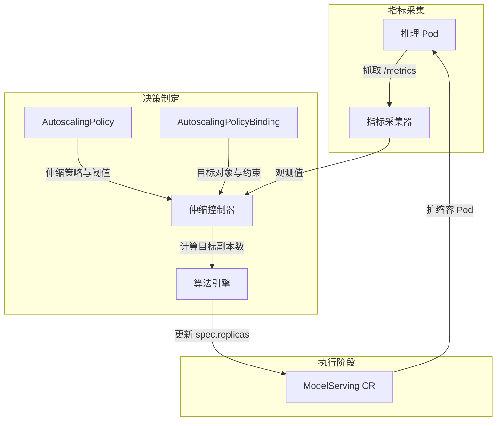

# Kthena Autoscaler 深度解析：面向 LLM 推理的智能弹性伸缩

> *作者：Kthena 社区*  
> *发布日期：2026 年*  
> *标签：#弹性伸缩 #Kubernetes #大模型 #云原生 #Volcano*

---

随着大语言模型（LLM）在现代 AI 应用中的核心地位日益凸显，支撑其运行的基础设施也必须演进，以满足性能、可扩展性和成本的多重挑战。当智能路由和模型编排解决了"请求去哪里"的问题后，一个关键问题随之而来：**在任何时刻，应该运行多少个推理实例？**

答案就是 **Kthena Autoscaler** —— Kthena 系统的可选组件，运行于 Kubernetes 环境中，能够根据实时负载动态调整部署的推理服务实例数量 [[1]]。它在保障业务指标（如 SLO）健康的同时，优化计算资源消耗，确保您的 LLM 推理基础设施既响应迅速又成本可控。

本文将深入剖析 Kthena Autoscaler 的架构设计、核心算法与实战用法，探讨它如何为生产级 LLM 工作负载提供智能的、模型感知的弹性伸缩能力。

---

## 1. 为什么 LLM 推理需要专用弹性伸缩？

LLM 推理工作负载具有独特的特征，对传统弹性伸缩方案提出挑战：

| 特征 | 对伸缩的影响 |
|------|-------------|
| **突发流量模式** | 用户请求突然激增时需要快速扩容以维持延迟 SLO |
| **高资源消耗** | 每个推理实例消耗大量 GPU/NPU 资源，过度预配成本高昂 |
| **Prefill/Decode 不对称** | PD 解耦部署需要对预填和解码角色独立伸缩 [[34]] |
| **冷启动开销** | 加载大模型到内存需要数秒至数分钟，伸缩决策需考虑此延迟 |
| **异构硬件** | 不同实例类型（不同代际 GPU/NPU）提供不同的性能/成本权衡 |

传统的 Kubernetes HPA 或 KEDA 虽然强大，但缺乏针对 LLM 工作负载的**模型感知能力**。Kthena Autoscaler 通过以下方式弥合这一差距：

- 采集**推理专属指标**（队列长度、KV Cache 利用率、TTFT/TPOT 延迟）
- 支持**角色级伸缩**，适配 PD 解耦架构
- 实现**成本感知优化**，在异构实例类型间智能调度
- 提供**紧急模式（Panic Mode）**，快速响应流量洪峰

---

## 2. 架构概览

Kthena Autoscaler 遵循 Kubernetes 控制器模式设计。从指标采集到副本修改的逻辑流程如下图所示：



### 核心组件

1. **指标采集器（Metrics Collector）**  
   Autoscaler 依赖于推理 Pod 自身暴露的**业务级指标**。它定期从引擎的 `/metrics` 端点抓取运行时指标。为了使弹性伸缩生效，Pod **必须**以 Prometheus 兼容格式暴露这些指标（例如 vLLM 内置的 metrics）。常见指标包括：
   - `kthena:num_requests_waiting` (或 `vllm:num_requests_waiting`)：等待队列长度
   - `kthena:kv_cache_usage_perc`：KV Cache 利用率
   - `kthena:time_to_first_token`：首字延迟（TTFT）

2. **伸缩控制器（Scaling Controller）**  
   实现核心伸缩逻辑：通过对比观测指标与目标值，计算并更新 `ModelServing` 的副本数。

3. **算法引擎（Algorithm Engine）**  
   支持**同构实例伸缩**（单实例类型）和**异构实例伸缩**（成本感知的多实例优化）。

### Policy 与 Binding：核心抽象

Kthena 通过两个主要的自定义资源（CRD）将“如何伸缩”与“伸缩什么”进行解耦：

- **AutoscalingPolicy**：可复用的模板，定义**伸缩逻辑**。它指定了监控哪些指标、指标的 `targetValue`（目标值）以及伸缩行为（稳定/紧急模式、稳定窗口等）。
- **AutoscalingPolicyBinding**：连接策略与目标的“粘合剂”，定义**伸缩对象**。它将 `AutoscalingPolicy` 绑定到特定的 `ModelServing`（或其中的 `Role`），并定义运行约束，如 `minReplicas`、`maxReplicas` 以及抓取指标的 `metricEndpoint`。

---

## 3. 同构伸缩：稳定模式与紧急模式

对于单实例类型部署（例如全部使用 A100 GPU 的 vLLM Pod），Kthena Autoscaler 实现了双模式策略：

### 稳定模式（Stable Mode）
- 使用**稳定窗口**（如 1 分钟）观察持续负载后再执行伸缩
- 避免对瞬时波动过度反应
- 按配置的 `period` 间隔（如 30 秒）评估指标

### 紧急模式（Panic Mode）
- 当指标超过 `panicThresholdPercent`（如目标值的 150%）时触发
- 绕过稳定窗口，实现快速扩容
- 维持紧急状态 `panicModeHold` 时长（如 5 分钟）以应对持续洪峰

```yaml
# AutoscalingPolicy 示例
apiVersion: workload.serving.volcano.sh/v1alpha1
kind: AutoscalingPolicy
metadata:
  name: llm-scaling-policy
spec:
  metrics:
  - metricName: kthena:num_requests_waiting
    targetValue: 10.0  # 目标：每实例等待请求 ≤10
  tolerancePercent: 10  # ±10% 容差带
  behavior:
    scaleUp:
      panicPolicy:
        panicThresholdPercent: 150  # 15 个请求时进入紧急模式
        panicModeHold: 5m
      stablePolicy:
        stabilizationWindow: 1m
        period: 30s
    scaleDown:
      stabilizationWindow: 5m  # 缩容使用更长稳定窗口
      period: 1m
```

#### 字段含义解析

| 字段 | 描述 |
|------|------|
| `metricName` | 监控的指标名称，从推理 Pod 的 `/metrics` 端点抓取。 |
| `targetValue` | 每个实例期望的指标平均值。当观测到的平均值大于该值时，触发扩容。 |
| `tolerancePercent` | 容差范围。例如 10% 表示如果指标在 9.0 到 11.0 之间，则不触发任何伸缩动作，防止抖动。 |
| `behavior` | 定义扩容（scaleUp）和缩容（scaleDown）具体行为的根字段。 |
| `scaleUp.panicPolicy` | 配置“紧急模式”，用于在流量激增时绕过稳定窗口快速扩容。 |
| `panicThresholdPercent` | 触发紧急模式的阈值百分比。150% 表示指标达到 15.0 (10.0 * 1.5) 时立即进入紧急模式。 |
| `panicModeHold` | 紧急模式的保持时间。防止在流量波动时过快退出紧急模式并执行缩容。 |
| `scaleUp.stablePolicy` | 标准的“稳定”扩容配置，基于持续趋势进行决策。 |
| `stabilizationWindow` | 观测窗口时长。对于扩容，它确保负载在 1 分钟内持续处于高位才会增加副本。 |
| `period` | 评估周期。Autoscaler 每隔多长时间计算一次指标并做出伸缩决策。 |
| `scaleDown` | 缩容配置。通常设置较长的 `stabilizationWindow` 以避免 Pod 频繁重启影响稳定性。 |

### 面向 PD 解耦的角色级伸缩

关键差异化能力：支持在单个 `ModelServing` CRD 内进行**角色级伸缩**。在 PD 解耦部署中，预填（prefill）和解码（decode）角色具有不同的资源特征和伸缩需求 [[34]]：

```yaml
apiVersion: workload.serving.volcano.sh/v1alpha1
kind: AutoscalingPolicyBinding
metadata:
  name: pd-role-binding
spec:
  policyRef:
    name: llm-scaling-policy
  homogeneousTarget:
    target:
      targetRef:
        kind: ModelServing
        name: deepseek-serving
      subTargets:
        kind: Role
        name: decode  # 仅伸缩 decode 角色
    minReplicas: 2
    maxReplicas: 8
```

#### 字段含义解析

| 字段 | 描述 |
|------|------|
| `policyRef` | 引用包含伸缩逻辑（指标、阈值等）的 `AutoscalingPolicy`。 |
| `homogeneousTarget` | 当伸缩单实例类型时使用。包含目标识别信息和伸缩约束。 |
| `targetRef` | 识别要进行伸缩的顶层资源（如 `ModelServing` CR）。 |
| `subTargets` | 可选字段。允许对目标内部的特定组件进行精细化伸缩。 |
| `subTargets.kind` | 子目标的类型。在 Kthena 中，使用 `Role` 来针对特定的 PD 解耦角色。 |
| `subTargets.name` | `ModelServing` 规范中定义的特定角色名称（如 `decode`）。 |
| `minReplicas` | 该特定目标/角色允许的最小副本数。 |
| `maxReplicas` | 该特定目标/角色允许的最大副本数。 |

这使得精细化优化成为可能：在长输出场景下扩容 decode 副本，同时保持 prefill 副本稳定。

---

## 4. 异构伸缩：成本感知优化

对于高级部署场景（如混合使用 A100/H100 GPU，或 GPU/NPU 异构集群），Kthena Autoscaler 实现了复杂的**成本感知优化算法**。

### 问题定义

给定：
- N 种实例类型，每种具有不同成本（`c_i`）和性能特征
- 基于指标预测的总实例需求 `K`
- 每种实例类型的最小/最大副本约束

求解最优实例组合，满足：
1. 总需求 `K`
2. 总成本最小化
3. 考虑冷启动开销，优先复用已运行实例

### 算法：带倍增策略的贪心算法

Kthena 采用**贪心算法 + 指数分批**策略 [[40]][[41]]：

1. **计算容量**：对每种实例类型 `i`，计算可用容量 `C_i = maxReplicas_i - minReplicas_i`

2. **生成批次**：使用 `costExpansionRate`（默认 200%），将容量划分为指数级批次：
   ```
   批次大小：P^0, P^1, P^2, ... 其中 P = costExpansionRate
   ```

3. **按成本排序**：混合所有实例类型的批次，按单位实例成本升序排序

4. **构建伸缩序列**：将排序后的批次展开为线性序列 `seq`，表示实例添加顺序

5. **选择前 K 项**：当预测需要 `K` 个额外实例时，取 `seq` 的前 `K` 项

数学表达：
```
seq = sorted( ⋃_{i=1}^{N} { P^k · c_i | k ∈ (0,1,...,M_i) } ∪ { (C_i - Σ_{k=0}^{M_i} P^k) · c_i } )
```

其中：
- `N`：实例类型数量
- `P`：costExpansionRate
- `c_i`：实例类型 `i` 的成本
- `M_i`：类型 `i` 的显式幂次项数量
- `C_i`：类型 `i` 的总容量

### 算法优势

- **成本效率**：在性能允许时优先选择低成本实例
- **减少冷启动**：序列在多次伸缩周期中保持实例顺序，最大化复用已运行 Pod
- **灵活调优**：通过 `costExpansionRate` 调节成本优化与选择灵活性的权衡

### 配置示例

```yaml
apiVersion: workload.serving.volcano.sh/v1alpha1
kind: AutoscalingPolicyBinding
metadata:
  name: heterogeneous-binding
spec:
  policyRef:
    name: llm-scaling-policy
  heterogeneousTarget:
    costExpansionRatePercent: 20  # 允许 20% 成本溢价换取更好性能
    params:
    - target:
        targetRef:
          kind: ModelServing
          name: h100-serving  # 高性能，高成本
      minReplicas: 1
      maxReplicas: 4
      cost: 100  # 相对成本单位
    - target:
        targetRef:
          kind: ModelServing
          name: a100-serving  # 性能/成本平衡
      minReplicas: 2
      maxReplicas: 8
      cost: 60
    - target:
        targetRef:
          kind: ModelServing
          name: ascend-serving  # 成本优化型 NPU
      minReplicas: 0
      maxReplicas: 10
      cost: 30
```

---

## 5. 与 ModelServing 和 Volcano 的集成

Kthena Autoscaler 并非孤立运行，它与以下组件紧密集成：

### ModelServing CRD
- Autoscaler 监听 `ModelServing` 资源，更新 `spec.replicas` 或角色级 `replicas` 字段
- 支持三层架构（`ModelServing → ServingGroup → Role`）以应对复杂部署模式 [[27]]

### Volcano 帮派调度（Gang Scheduling）
- 扩容时，新 Pod 携带 `PodGroup` 标签创建
- Volcano 调度器确保帮派感知部署的"全或无"调度
- 避免部分扩容导致推理工作流中断

### 指标流水线
```
推理 Pod (vLLM/SGLang/TGI)
         │
         ▼
   /metrics 端点
         │
         ▼
Autoscaler 指标采集器
         │
         ▼
   Prometheus 兼容格式
         │
         ▼
伸缩决策引擎
```

可通过 `metricEndpoint` 配置自定义指标端点：
```yaml
metricEndpoint:
  uri: "/custom-metrics"
  port: 9090
  labelSelector:
    matchLabels:
      inference-role: prefill
```

---

## 6. 实战指南：扩缩容 vLLM 服务

让我们通过一个具体示例，演练如何根据请求队列长度对 vLLM `ModelServing` 进行弹性伸缩。

### 步骤 1：创建 AutoscalingPolicy

此策略定义了**如何**伸缩。我们使用 vLLM 特有的 `vllm:num_requests_waiting` 指标。

```yaml
apiVersion: workload.serving.volcano.sh/v1alpha1
kind: AutoscalingPolicy
metadata:
  name: vllm-queue-policy
spec:
  metrics:
  - metricName: vllm:num_requests_waiting
    targetValue: 5.0
  tolerancePercent: 10
  behavior:
    scaleUp:
      stablePolicy:
        stabilizationWindow: 30s
        period: 10s
    scaleDown:
      stabilizationWindow: 5m
      period: 30s
```

**字段含义解析：**
- `metricName`: 监控的具体业务指标。必须与 vLLM Pod 的 `/metrics` 端点暴露的指标名完全匹配。
- `targetValue`: 每个副本的期望平均值。本例中，我们的目标是每个实例的等待请求数不超过 5 个。如果平均值超过此阈值（考虑容差后），Autoscaler 将触发扩容。
- `tolerancePercent`: 容差带，用于防止频繁的微小调整。设置 10% 容差意味着只有当指标 > 5.5 或 < 4.5 时才会触发伸缩。
- `stabilizationWindow`: 稳定窗口。在执行伸缩前观察指标持续的时间。缩容设置 `5m` 可以确保在流量低谷确实稳定后再回收资源，避免因短暂抖动导致频繁重启。

### 步骤 2：将策略绑定到 vLLM ModelServing

Binding 定义了**伸缩对象**及其约束。

```yaml
apiVersion: workload.serving.volcano.sh/v1alpha1
kind: AutoscalingPolicyBinding
metadata:
  name: vllm-binding
spec:
  policyRef:
    name: vllm-queue-policy
  homogeneousTarget:
    target:
      targetRef:
        kind: ModelServing
        name: vllm-llama3
    minReplicas: 1
    maxReplicas: 10
  metricEndpoint:
    uri: "/metrics"
    port: 8000
```

**字段含义解析：**
- `policyRef`: 引用步骤 1 中创建的 `AutoscalingPolicy`。
- `targetRef`: 指定要进行伸缩的 `ModelServing` 资源。
- `minReplicas` / `maxReplicas`: 副本数的绝对下限和上限。
- `metricEndpoint`: 指示 Autoscaler 从 Pod 的哪个位置抓取指标。vLLM 通常在 8000 端口的 `/metrics` 路径暴露指标。

### 步骤 3：验证伸缩效果

您可以通过 Binding 的状态监控伸缩活动：

```bash
# 查看当前状态和决策详情
kubectl get autoscalingpolicybinding vllm-binding -o yaml
```

---

## 7. 最佳实践与故障排查

### 配置建议

1. **保守起步**：初始配置使用较宽容差带（15-20%）和较长稳定窗口
2. **关注冷启动**：在紧急模式持续时间中考虑模型加载时间
3. **角色差异化目标**：根据 prefill/decode 的瓶颈特征设置不同 `targetValue`
4. **成本校准**：异构伸缩时，对照实际云定价或 TCO 验证 `cost` 值

### 常见问题

| 问题 | 现象 | 解决方案 |
|------|------|----------|
| 指标采集失败 | 无伸缩事件，日志显示 "connection refused" | 确认 `metricEndpoint` 端口/URI 与推理引擎配置匹配 |
| 伸缩抖动 | 副本数频繁振荡 | 增大 `tolerancePercent` 或 `stabilizationWindow` |
| 紧急模式未触发 | 流量峰值导致延迟 SLO 违反 | 降低 `panicThresholdPercent` 或增加 `panicModeHold` |
| 异构伸缩偏好高价实例 | 成本意外偏高 | 降低 `costExpansionRatePercent` 或重新校准 `cost` 值 |

### 可观测性

Kthena Autoscaler 在 `/metrics` 暴露以下指标：
- `kthena_autoscaler_desired_replicas`：伸缩决策后的目标副本数
- `kthena_autoscaler_current_replicas`：实际观测到的副本数
- `kthena_autoscaler_scaling_events_total`：扩容/缩容动作计数器
- `kthena_autoscaler_metric_collection_errors`：指标采集失败计数

可集成 Prometheus/Grafana 实现伸缩异常的监控告警。

---

## 8. 未来展望

Kthena 社区正在持续增强 Autoscaler 能力：

- **预测性伸缩**：集成时间序列预测，提前感知流量模式
- **多指标优化**：支持跨多指标（如队列长度 + 延迟）的复合伸缩决策
- **跨集群伸缩**：将异构优化扩展至多集群部署场景
- **SLO 驱动策略**：允许直接指定延迟/吞吐量 SLO，替代指标阈值

我们欢迎社区贡献！无论您对算法改进、新指标集成还是文档增强感兴趣，都欢迎加入 GitHub 社区：[volcano-sh/kthena](https://github.com/volcano-sh/kthena)。

---

## 总结

Kthena Autoscaler 代表了云原生 LLM 基础设施的重要演进。通过结合模型感知指标、角色级粒度和成本感知优化，它使生产团队能够：

✅ 在流量峰值期间维持延迟 SLO  
✅ 通过智能资源分配降低基础设施成本  
✅ 支持复杂的 PD 解耦和异构部署  
✅ 以 Kubernetes 原生模式运行，具备完整可观测性  

随着 LLM 工作负载持续演进，对智能自适应弹性伸缩的需求只会增长。Kthena Autoscaler 为构建大规模、高韧性、高效率且成本可控的推理平台提供了坚实基础。

*准备开始体验？*  
🔗 [Kthena 官方文档](https://kthena.volcano.sh)  
🔗 [Autoscaler 用户指南](https://kthena.volcano.sh/docs/user-guide/autoscaler)  
🔗 [GitHub 仓库](https://github.com/volcano-sh/kthena)

---

> *本文是 Kthena 技术博客系列的一部分。如需了解更多关于 Kthena Router、ModelServing 和 ModelBooster 的深度解析，请访问 [kthena.volcano.sh/blog](https://kthena.volcano.sh/blog)。*
