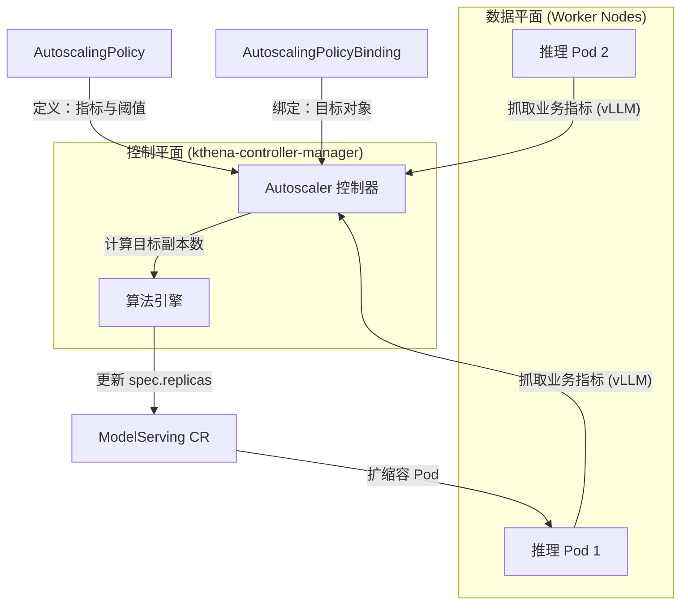

# Kthena Autoscaler 深度解析：面向 LLM 推理的智能弹性伸缩


---

随着大语言模型（LLM）在现代 AI 应用中的核心地位日益凸显，支撑其运行的基础设施也必须演进。当智能路由和模型编排解决了"请求去哪里"的问题后，一个关键问题随之而来：**在任何时刻，应该运行多少个推理实例？**

答案就是 **Kthena Autoscaler** —— 它内置于 **kthena-controller-manager** 中，作为核心控制器运行于 Kubernetes 环境，能够根据实时负载动态调整部署的推理服务实例数量。它在保障业务指标（如 SLO）健康的同时，优化计算资源消耗。

本文将深入剖析 Kthena Autoscaler 的架构设计、通用策略逻辑与多样化的绑定形态。

---

## 1. 为什么 LLM 推理需要专用弹性伸缩？

LLM 推理工作负载具有独特的特征，对传统弹性伸缩方案提出挑战：

| 特征 | 对伸缩的影响 |
|---------------|----------------|
| **业务指标驱动** | 相比于 CPU/内存利用率，推理引擎（如 vLLM）暴露的**队列长度、KV Cache 利用率**等业务指标更能直接反映服务饱和度。 |
| **突发流量模式** | 用户请求突然激增时需要快速扩容以维持延迟 SLO |
| **Prefill/Decode 不对称** | PD 解耦部署需要对预填和解码角色进行独立且灵活的伸缩。 |
| **异构硬件与成本** | 不同实例类型（GPU/NPU）提供不同的性能/成本权衡，需要精细化调度。 |

传统的 Kubernetes HPA 或 KEDA 缺乏针对 LLM 工作负载的**模型感知能力**。Kthena Autoscaler 通过 **直连 Pod 采集业务指标**、**角色级伸缩支持** 以及 **成本感知优化算法** 弥合了这一差距。

---

## 2. 架构概览

Kthena Autoscaler 遵循控制器模式，作为 `kthena-controller-manager` 的子控制器运行。它通过直接采集 Pod 业务指标，结合用户定义的策略进行闭环控制。



---

## 3. 通用策略 (AutoscalingPolicy)：定义“如何缩容”

**AutoscalingPolicy** 是一个通用的逻辑模板，定义了计算副本需求的核心大脑。

### 3.1 核心指标与容差
Autoscaler 允许直接从 Pod 的 `/metrics` 端点抓取**推理专属指标**。这意味着它能感知到 vLLM 内部的请求队列状态。常见指标包括：
- `vllm:num_requests_waiting`：等待队列长度（最核心指标）。
- `vllm:gpu_cache_usage_perc`：KV Cache 利用率。

通过 `targetValue` 设置目标值，并利用 `tolerancePercent`（容差带）防止在目标值附近的微小抖动触发频繁伸缩。

### 3.2 伸缩行为：稳定模式与紧急模式
为了应对推理场景的流量特性，Policy 支持双模式策略：
- **稳定模式 (Stable Mode)**：使用较长的**稳定窗口**（如 1 分钟）观察持续趋势，避免对瞬时波动过度反应。
- **紧急模式 (Panic Mode)**：当指标严重偏离目标（如超过 150%）时触发，绕过稳定窗口实现秒级快速扩容。

### 3.3 成本感知优化算法
当伸缩涉及多个实例类型或硬件时，Policy 底层的算法引擎会执行**带倍增策略的贪心算法**。

该算法根据每种实例类型的**单位成本 (Cost)** 将容量划分为指数级批次（基于 `costExpansionRate`），并按成本升序排序生成伸缩序列。这确保了：
1. **成本效率**：优先选择低成本实例。
2. **减少冷启动**：序列在周期内保持稳定，优先复用已运行的实例。

---

## 4. 伸缩绑定 (AutoscalingPolicyBinding)：定义“缩容什么”

**AutoscalingPolicyBinding** 是连接通用策略与具体目标的“粘合剂”。通过不同的绑定目标，可以实现完全不同的伸缩形态。

### 4.1 作用于 ServingGroup：实现固定 PD 比例伸缩
这是最常见的形态。将 Policy 绑定到 `ModelServing` 或其中的 `ServingGroup`。
- **逻辑**：Autoscaler 将整组作为一个整体进行扩缩。
- **效果**：系统会严格保持定义的 Role 比例（如 prefill:decode = 1:2）同步增减。这适用于 PD 拓扑固定的标准部署场景。

### 4.2 作用于 Role：实现独立 PD 异构伸缩
将 Policy 绑定到 `ModelServing` 内特定的 `Role`（如仅绑定 `decode` 角色）。
- **逻辑**：Autoscaler 仅针对该特定角色计算并修改副本数。
- **效果**：可以实现 prefill 副本保持稳定，而 decode 副本根据长输出负载独立增加。这种**PD 异构伸缩**能极大提高资源利用率。

```yaml
# 独立绑定到 Role 的示例
apiVersion: workload.serving.volcano.sh/v1alpha1
kind: AutoscalingPolicyBinding
metadata:
  name: decode-independent-binding
spec:
  policyRef:
    name: llm-scaling-policy
  homogeneousTarget:
    target:
      targetRef:
        kind: ModelServing
        name: deepseek-serving
      subTargets:
        kind: Role
        name: decode  # 仅针对 decode 角色独立伸缩
    minReplicas: 2
    maxReplicas: 8
```

### 4.3 异构目标绑定：跨硬件成本优化
当 Binding 包含 `heterogeneousTarget` 字段时，可以定义多个具有不同成本的 `ModelServing` 目标。
- **逻辑**：算法引擎会综合考虑所有目标的副本数和成本，计算最优组合。
- **效果**：在混合集群中，Autoscaler 会根据成本优先级，在 A100、H100 或 NPU 之间自动分配推理实例。

---

## 5. 实战指南：扩缩容 vLLM 服务

### 步骤 1：创建通用的 AutoscalingPolicy
```yaml
apiVersion: workload.serving.volcano.sh/v1alpha1
kind: AutoscalingPolicy
metadata:
  name: vllm-queue-policy
spec:
  metrics:
  - metricName: vllm:num_requests_waiting
    targetValue: 5.0
  tolerancePercent: 10
  behavior:
    scaleUp:
      stablePolicy: { stabilizationWindow: 30s }
    scaleDown:
      stablePolicy: { stabilizationWindow: 5m }
```

### 步骤 2：通过 Binding 决定伸缩形态
如果您希望 **PD 固定比例同步扩缩**，则绑定到 ServingGroup（默认）：
```yaml
apiVersion: workload.serving.volcano.sh/v1alpha1
kind: AutoscalingPolicyBinding
metadata:
  name: vllm-group-binding
spec:
  policyRef:
    name: vllm-queue-policy
  homogeneousTarget:
    target:
      targetRef: { kind: ModelServing, name: vllm-llama3 }
    minReplicas: 1
    maxReplicas: 10
```

如果您希望 **PD 异构扩缩**，则针对 Role 进行绑定。

---

## 6. 最佳实践与故障排查

### 配置建议
1. **保守起步**：初始配置使用较宽容差带 (15-20%) 和较长稳定窗口。
2. **角色差异化目标**：在 PD 异构场景下，为 decode 角色设置比 prefill 更敏感的阈值。
3. **成本校准**：异构伸缩时，根据实际云定价或 TCO 调整 `cost` 值。

### 可观测性
Kthena Autoscaler 在 `/metrics` 暴露以下指标：
- `kthena_autoscaler_desired_replicas`：决策后的目标副本数。
- `kthena_autoscaler_current_replicas`：实际观测到的副本数。
- `kthena_autoscaler_scaling_events_total`：伸缩动作计数器。

---

## 总结

Kthena Autoscaler 通过将“伸缩逻辑 (Policy)”与“伸缩目标 (Binding)”解耦，提供了极大的灵活性。通过 ServingGroup 绑定可以实现稳定的**固定比例扩缩**，而通过 Role 绑定则能实现精细的**异构扩缩**。结合内置控制器的架构和成本感知算法，它为构建高效、低成本的 LLM 推理平台提供了坚实基础。

🔗 [Kthena 官方文档](https://kthena.volcano.sh)  
🔗 [GitHub 仓库](https://github.com/volcano-sh/kthena)
