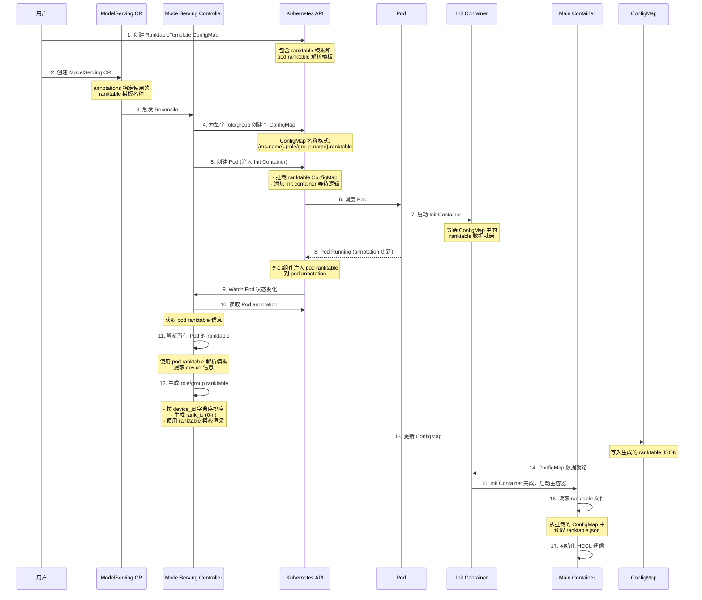

## Mount group/role level ranktable for Ascend resources - 详细设计方案

### 概述

本文档提供了为 Ascend 910 资源生成 role/group 级别 ranktable 的详细设计方案。该方案支持 vLLM-Ascend 和 MindIE 推理引擎的 HCCL 通信需求。

### 架构设计

#### 核心组件

1. **Pod Ranktable Parser Template ConfigMap**: 存储 Pod ranktable 解析模板，负责解析 Pod annotation 中的 ranktable 数据
2. **Role/Group Ranktable Template ConfigMap**: 存储 ranktable 生成模板，引用对应的 Parser Template
3. **ModelServing Controller**: 负责监听 Pod 状态，生成和更新 ranktable ConfigMap
4. **Init Container**: 等待 ranktable ConfigMap 就绪后再启动主容器
5. **Ranktable ConfigMap**: 存储生成的 role/group 级别的 ranktable

#### 工作流程时序图



### 模板设计

为了提高模板的复用性，将 Pod Ranktable 解析模板和 Role/Group Ranktable 生成模板拆分为两个独立的 ConfigMap。这样不同的 Role Template 可以复用同一个 Pod Parser Template。

#### Role/Group Ranktable Template ConfigMap

Role/Group Ranktable Template 负责生成最终的 ranktable JSON，并在模板中指定使用的 Pod Parser Template。

**MindIE Role 级别模板**:

```yaml
apiVersion: v1
kind: ConfigMap
metadata:
  name: ascend-ranktable-template-mindie-role
  namespace: kthena-system
  labels:
    app.kubernetes.io/component: ranktable-template
    inference-engine: mindie
    ranktable-level: role
data:
  # 推理引擎类型: mindie 或 vllm-ascend
  inference-engine: "mindie"
  
  # ranktable 生成级别: role 或 group
  ranktable-level: "role"
  
  # 引用的 Pod Ranktable Parser Template 名称
  pod-parser-template: "ascend-pod-ranktable-parser-standard"
  
  # Role/Group Ranktable 生成模板 (Go Template)
  # 输入: RanktableTemplateData 结构
  # 输出: 最终的 ranktable JSON
  ranktable-template: |
    {
      "version": "1.0",
      "server_count": "{{ .ServerCount }}",
      "server_list": [
        {{- range $serverIdx, $server := .Servers }}
        {{- if $serverIdx }},{{ end }}
        {
          "server_id": {{ $server.ServerId | quote }},
          "device": [
            {{- range $devIdx, $device := $server.Devices }}
            {{- if $devIdx }},{{ end }}
            {
              "device_id": {{ $device.DeviceId | quote }},
              "device_ip": {{ $device.DeviceIp | quote }},
              "rank_id": {{ $device.RankId | quote }}
            }
            {{- end }}
          ]
        }
        {{- end }}
      ],
      "status": "{{ .Status }}"
    }
  
  # ConfigMap 挂载路径
  mount-path: "/etc/ascend/ranktable"
  
  # Ranktable 文件名
  filename: "ranktable.json"
```

**vLLM-Ascend Group 级别模板**:

```yaml
apiVersion: v1
kind: ConfigMap
metadata:
  name: ascend-ranktable-template-vllm-group
  namespace: kthena-system
  labels:
    app.kubernetes.io/component: ranktable-template
    inference-engine: vllm-ascend
    ranktable-level: group
data:
  inference-engine: "vllm-ascend"
  ranktable-level: "group"
  
  # 引用的 Pod Ranktable Parser Template 名称
  pod-parser-template: "ascend-pod-ranktable-parser-standard"
  
  ranktable-template: |
    {
      "version": "1.0",
      "server_count": "{{ .ServerCount }}",
      "server_list": [
        {{- range $serverIdx, $server := .Servers }}
        {{- if $serverIdx }},{{ end }}
        {
          "server_id": {{ $server.ServerId | quote }},
          "device": [
            {{- range $devIdx, $device := $server.Devices }}
            {{- if $devIdx }},{{ end }}
            {
              "device_id": {{ $device.DeviceId | quote }},
              "device_ip": {{ $device.DeviceIp | quote }},
              "rank_id": {{ $device.RankId | quote }}
            }
            {{- end }}
          ]
        }
        {{- end }}
      ],
      "status": "{{ .Status }}"
    }
  
  mount-path: "/etc/ascend/ranktable"
  filename: "ranktable.json"
```

**简化版模板**:

```yaml
apiVersion: v1
kind: ConfigMap
metadata:
  name: ascend-ranktable-template-mindie-simple
  namespace: kthena-system
  labels:
    app.kubernetes.io/component: ranktable-template
    inference-engine: mindie
    ranktable-level: role
data:
  inference-engine: "mindie"
  ranktable-level: "role"
  
  # 简化版模板，仅包含必要字段
  ranktable-template: |
    {
      "server_count": "{{ .ServerCount }}",
      "server_list": [
        {{- range $idx, $server := .Servers }}
        {{- if $idx }},{{ end }}
        {
          "server_id": {{ $server.ServerId | quote }},
          "device": [
            {{- range $didx, $dev := $server.Devices }}
            {{- if $didx }},{{ end }}
            {"device_id": {{ $dev.DeviceId | quote }}, "rank_id": {{ $dev.RankId | quote }}}
            {{- end }}
          ]
        }
        {{- end }}
      ]
    }
  
  mount-path: "/etc/ascend/ranktable"
  filename: "ranktable.json"
```

### 数据结构定义

#### Go Template 数据结构

```go
// PodRanktableData 表示单个 Pod 的 ranktable 信息
type PodRanktableData struct {
    PodName  string
    ServerId string
    Devices  []DeviceInfo
}

// DeviceInfo 表示设备信息
type DeviceInfo struct {
    DeviceId string
    DeviceIp string
}

// RanktableTemplateData 表示用于生成 role/group ranktable 的数据
type RanktableTemplateData struct {
    Status       string
    ServerCount  int
    TotalDevices int
    Timestamp    string
    Servers      []ServerInfo
}

// ServerInfo 表示服务器信息
type ServerInfo struct {
    ServerId string
    Devices  []DeviceWithRank
}

// DeviceWithRank 表示带 rank_id 的设备信息
type DeviceWithRank struct {
    DeviceId string
    DeviceIp string
    RankId   string  // 根据 device_id 字典序生成，从 0 开始
}
```

### ModelServing CR 使用示例

```yaml
apiVersion: workload.kthena.io/v1alpha1
kind: ModelServing
metadata:
  name: qwen-inference
  namespace: default
  annotations:
    # 指定使用的 Role/Group Ranktable Template
    # Parser Template 会从 Ranktable Template 中自动引用
    kthena.io/ranktable-template: "ascend-ranktable-template-mindie-role"
    # 可选: 指定 ranktable 生成级别 (覆盖模板中的默认值)
    kthena.io/ranktable-level: "role"
spec:
  model:
    name: Qwen2.5-7B-Instruct
    source:
      modelHub: ModelScope
  roles:
    - name: worker
      replicas: 2
      template:
        spec:
          containers:
            - name: inference
              image: ascend-inference:latest
              resources:
                limits:
                  ascend.com/npu: "8"
              # ranktable ConfigMap 将自动挂载到此路径
              volumeMounts:
                - name: ranktable
                  mountPath: /etc/ascend/ranktable
                  readOnly: true
```

### Controller 实现逻辑

#### 1. Reconcile 流程

```go
func (r *ModelServingReconciler) Reconcile(ctx context.Context, req ctrl.Request) (ctrl.Result, error) {
    // 1. 获取 ModelServing CR
    ms := &workloadv1alpha1.ModelServing{}
    if err := r.Get(ctx, req.NamespacedName, ms); err != nil {
        return ctrl.Result{}, client.IgnoreNotFound(err)
    }
    
    // 2. 检查是否需要生成 ranktable
    ranktableTemplateName := ms.Annotations["kthena.io/ranktable-template"]
    
    if ranktableTemplateName == "" {
        // 不需要生成 ranktable，正常处理
        return r.reconcileNormal(ctx, ms)
    }
    
    // 3. 获取 Ranktable Template (会自动加载引用的 Parser Template)
    template, err := r.getRanktableTemplates(ctx, ms)
    if err != nil {
        return ctrl.Result{}, err
    }
    
    // 4. 为每个 role/group 创建 ranktable ConfigMap (如果不存在)
    if err := r.ensureRanktableConfigMaps(ctx, ms, template); err != nil {
        return ctrl.Result{}, err
    }
    
    // 5. 创建/更新 Pods (注入 init container 和 volume)
    if err := r.reconcilePods(ctx, ms, template); err != nil {
        return ctrl.Result{}, err
    }
    
    // 6. 检查所有 Pods 是否已经有 ranktable annotation
    pods, allReady, err := r.checkPodsRanktableReady(ctx, ms)
    if err != nil {
        return ctrl.Result{}, err
    }
    
    if !allReady {
        // 等待所有 Pods 的 annotation 就绪
        return ctrl.Result{RequeueAfter: 5 * time.Second}, nil
    }
    
    // 7. 生成并更新 ranktable ConfigMaps
    if err := r.generateAndUpdateRanktables(ctx, ms, template, pods); err != nil {
        return ctrl.Result{}, err
    }
    
    return ctrl.Result{}, nil
}
```

#### 2. 获取模板逻辑 (从 Ranktable Template 读取 Parser Template 引用)

```go
func (r *ModelServingReconciler) getRanktableTemplates(
    ctx context.Context,
    ms *workloadv1alpha1.ModelServing,
) (*RanktableTemplate, error) {
    // 1. 从 ModelServing annotations 获取 Ranktable Template 名称
    ranktableTemplateName := ms.Annotations["kthena.io/ranktable-template"]
    
    if ranktableTemplateName == "" {
        return nil, fmt.Errorf("ranktable-template annotation must be specified")
    }
    
    // 2. 获取 Role/Group Ranktable Template ConfigMap
    roleTemplate := &corev1.ConfigMap{}
    if err := r.Get(ctx, types.NamespacedName{
        Name:      ranktableTemplateName,
        Namespace: "kthena-system", // 模板统一存放在 kthena-system namespace
    }, roleTemplate); err != nil {
        return nil, fmt.Errorf("failed to get ranktable template %s: %w", ranktableTemplateName, err)
    }
    
    // 3. 从 Ranktable Template 中获取 Pod Parser Template 引用
    podParserTemplateName := roleTemplate.Data["pod-parser-template"]
    if podParserTemplateName == "" {
        return nil, fmt.Errorf("pod-parser-template not specified in ranktable template %s", ranktableTemplateName)
    }
    
    // 4. 获取 Pod Parser Template ConfigMap
    podParserTemplate := &corev1.ConfigMap{}
    if err := r.Get(ctx, types.NamespacedName{
        Name:      podParserTemplateName,
        Namespace: "kthena-system",
    }, podParserTemplate); err != nil {
        return nil, fmt.Errorf("failed to get pod parser template %s: %w", podParserTemplateName, err)
    }
    
    // 5. 构建 RanktableTemplate 对象
    return &RanktableTemplate{
        InferenceEngine:    roleTemplate.Data["inference-engine"],
        Level:              roleTemplate.Data["ranktable-level"],
        PodParserTemplate:  podParserTemplate.Data["parser-template"],
        RanktableTemplate:  roleTemplate.Data["ranktable-template"],
        MountPath:          roleTemplate.Data["mount-path"],
        Filename:           roleTemplate.Data["filename"],
    }, nil
}
```

#### 3. Ranktable 生成逻辑

```go
func (r *ModelServingReconciler) generateAndUpdateRanktables(
    ctx context.Context,
    ms *workloadv1alpha1.ModelServing,
    template *RanktableTemplate,
    pods []*corev1.Pod,
) error {
    // 按 role/group 分组 pods
    podGroups := r.groupPodsByRoleOrGroup(ms, pods, template.Level)
    
    for groupName, groupPods := range podGroups {
        // 1. 解析每个 Pod 的 ranktable annotation
        podRanktables := make([]PodRanktableData, 0, len(groupPods))
        for _, pod := range groupPods {
            annotation := pod.Annotations["ascend.com/ranktable"]
            if annotation == "" {
                continue
            }
            
            // 使用 pod-parser-template 解析
            podData, err := r.parsePodRanktable(template.PodParserTemplate, annotation)
            if err != nil {
                return err
            }
            podRanktables = append(podRanktables, podData)
        }
        
        // 2. 生成 RanktableTemplateData
        templateData := r.buildRanktableTemplateData(podRanktables)
        
        // 3. 使用 ranktable-template 生成最终的 ranktable JSON
        ranktableJSON, err := r.renderRanktable(template.RanktableTemplate, templateData)
        if err != nil {
            return err
        }
        
        // 4. 更新 ConfigMap
        cmName := fmt.Sprintf("%s-%s-ranktable", ms.Name, groupName)
        cm := &corev1.ConfigMap{}
        if err := r.Get(ctx, types.NamespacedName{
            Name:      cmName,
            Namespace: ms.Namespace,
        }, cm); err != nil {
            return err
        }
        
        cm.Data[template.Filename] = ranktableJSON
        if err := r.Update(ctx, cm); err != nil {
            return err
        }
    }
    
    return nil
}

func (r *ModelServingReconciler) buildRanktableTemplateData(
    podRanktables []PodRanktableData,
) RanktableTemplateData {
    // 按 server_id 分组
    serverMap := make(map[string][]DeviceInfo)
    for _, podData := range podRanktables {
        serverMap[podData.ServerId] = append(serverMap[podData.ServerId], podData.Devices...)
    }
    
    // 构建 Servers 列表
    servers := make([]ServerInfo, 0, len(serverMap))
    globalRankId := 0
    
    // 对 server_id 排序以保证确定性
    serverIds := make([]string, 0, len(serverMap))
    for serverId := range serverMap {
        serverIds = append(serverIds, serverId)
    }
    sort.Strings(serverIds)
    
    for _, serverId := range serverIds {
        devices := serverMap[serverId]
        
        // 按 device_id 字典序排序
        sort.Slice(devices, func(i, j int) bool {
            return devices[i].DeviceId < devices[j].DeviceId
        })
        
        // 生成 rank_id
        devicesWithRank := make([]DeviceWithRank, len(devices))
        for i, dev := range devices {
            devicesWithRank[i] = DeviceWithRank{
                DeviceId: dev.DeviceId,
                DeviceIp: dev.DeviceIp,
                RankId:   strconv.Itoa(globalRankId),
            }
            globalRankId++
        }
        
        servers = append(servers, ServerInfo{
            ServerId: serverId,
            Devices:  devicesWithRank,
        })
    }
    
    return RanktableTemplateData{
        ServerCount: len(servers),
        Servers:     servers,
    }
}
```

#### 3. Init Container 注入逻辑

```go
func (r *ModelServingReconciler) injectInitContainer(
    pod *corev1.Pod,
    template *RanktableTemplate,
    cmName string,
) {
    // 添加 Volume
    pod.Spec.Volumes = append(pod.Spec.Volumes, corev1.Volume{
        Name: "ranktable",
        VolumeSource: corev1.VolumeSource{
            ConfigMap: &corev1.ConfigMapVolumeSource{
                LocalObjectReference: corev1.LocalObjectReference{
                    Name: cmName,
                },
            },
        },
    })
    
    // 添加 Init Container
    initContainer := corev1.Container{
        Name:  "wait-ranktable",
        Image: "busybox:latest",
        Command: []string{
            "sh",
            "-c",
            fmt.Sprintf(`
                echo "Waiting for ranktable to be ready..."
                RANKTABLE_FILE="%s/%s"
                while [ ! -f "$RANKTABLE_FILE" ] || [ ! -s "$RANKTABLE_FILE" ]; do
                    echo "Ranktable not ready, waiting..."
                    sleep 2
                done
                echo "Ranktable is ready!"
                cat "$RANKTABLE_FILE"
            `, template.MountPath, template.Filename),
        },
        VolumeMounts: []corev1.VolumeMount{
            {
                Name:      "ranktable",
                MountPath: template.MountPath,
                ReadOnly:  true,
            },
        },
    }
    
    pod.Spec.InitContainers = append(pod.Spec.InitContainers, initContainer)
    
    // 为主容器添加 VolumeMount
    for i := range pod.Spec.Containers {
        pod.Spec.Containers[i].VolumeMounts = append(
            pod.Spec.Containers[i].VolumeMounts,
            corev1.VolumeMount{
                Name:      "ranktable",
                MountPath: template.MountPath,
                ReadOnly:  true,
            },
        )
    }
}
```

### 完整示例场景

#### 场景: 2 节点 MindIE 推理服务 (使用模板引用)

**1. 创建 Pod Ranktable Parser Template**

```yaml
apiVersion: v1
kind: ConfigMap
metadata:
  name: ascend-pod-ranktable-parser-standard
  namespace: kthena-system
  labels:
    app.kubernetes.io/component: pod-ranktable-parser
    parser-type: standard
data:
  parser-template: |
    {{- $data := . | fromJson -}}
    podName: {{ $data.pod_name | quote }}
    serverId: {{ $data.server_id | quote }}
    devices:
    {{- range $data.devices }}
      - deviceId: {{ .device_id | quote }}
        deviceIp: {{ .device_ip | quote }}
    {{- end }}
```

**2. 创建 Role Ranktable Template (包含 Parser 引用)**

```yaml
apiVersion: v1
kind: ConfigMap
metadata:
  name: ascend-ranktable-template-mindie-role
  namespace: kthena-system
  labels:
    app.kubernetes.io/component: ranktable-template
    inference-engine: mindie
    ranktable-level: role
data:
  inference-engine: "mindie"
  ranktable-level: "role"
  
  # 引用 Pod Parser Template
  pod-parser-template: "ascend-pod-ranktable-parser-standard"
  
  ranktable-template: |
    {
      "version": "1.0",
      "server_count": "{{ .ServerCount }}",
      "server_list": [
        {{- range $serverIdx, $server := .Servers }}
        {{- if $serverIdx }},{{ end }}
        {
          "server_id": {{ $server.ServerId | quote }},
          "device": [
            {{- range $devIdx, $device := $server.Devices }}
            {{- if $devIdx }},{{ end }}
            {
              "device_id": {{ $device.DeviceId | quote }},
              "device_ip": {{ $device.DeviceIp | quote }},
              "rank_id": {{ $device.RankId | quote }}
            }
            {{- end }}
          ]
        }
        {{- end }}
      ],
      "status": "{{ .Status }}"
    }
  
  mount-path: "/etc/ascend/ranktable"
  filename: "ranktable.json"
```

**3. 创建 ModelServing (仅指定 Ranktable Template)**

```yaml
apiVersion: workload.kthena.io/v1alpha1
kind: ModelServing
metadata:
  name: qwen-inference
  namespace: default
  annotations:
    # 仅指定 Role Ranktable Template
    # Parser Template 会从 Ranktable Template 中自动引用
    kthena.io/ranktable-template: "ascend-ranktable-template-mindie-role"
spec:
  model:
    name: Qwen2.5-7B-Instruct
  roles:
    - name: worker
      replicas: 2
      template:
        spec:
          containers:
            - name: inference
              image: mindie-inference:latest
              resources:
                limits:
                  ascend.com/npu: "8"
```

**3. Controller 自动创建 ConfigMap**

```yaml
apiVersion: v1
kind: ConfigMap
metadata:
  name: qwen-inference-worker-ranktable
  namespace: default
  ownerReferences:
    - apiVersion: workload.kthena.io/v1alpha1
      kind: ModelServing
      name: qwen-inference
      uid: xxx
data:
  ranktable.json: ""  # 初始为空
```

**4. Controller 创建 Pods (注入 Init Container)**

```yaml
apiVersion: v1
kind: Pod
metadata:
  name: qwen-inference-worker-0
  namespace: default
spec:
  initContainers:
    - name: wait-ranktable
      image: busybox:latest
      command:
        - sh
        - -c
        - |
          echo "Waiting for ranktable to be ready..."
          RANKTABLE_FILE="/etc/ascend/ranktable/ranktable.json"
          while [ ! -f "$RANKTABLE_FILE" ] || [ ! -s "$RANKTABLE_FILE" ]; do
              echo "Ranktable not ready, waiting..."
              sleep 2
          done
          echo "Ranktable is ready!"
          cat "$RANKTABLE_FILE"
      volumeMounts:
        - name: ranktable
          mountPath: /etc/ascend/ranktable
          readOnly: true
  containers:
    - name: inference
      image: mindie-inference:latest
      volumeMounts:
        - name: ranktable
          mountPath: /etc/ascend/ranktable
          readOnly: true
  volumes:
    - name: ranktable
      configMap:
        name: qwen-inference-worker-ranktable
```

**5. 外部组件注入 Pod Annotation**

Pod `qwen-inference-worker-0`:
```yaml
metadata:
  annotations:
    ascend.com/ranktable: |
      {
        "pod_name": "qwen-inference-worker-0",
        "server_id": "192.168.1.10",
        "devices": [
          {"device_id": "0", "device_ip": "10.20.0.2"},
          {"device_id": "1", "device_ip": "10.20.0.3"},
          {"device_id": "2", "device_ip": "10.20.0.4"},
          {"device_id": "3", "device_ip": "10.20.0.5"},
          {"device_id": "4", "device_ip": "10.20.0.6"},
          {"device_id": "5", "device_ip": "10.20.0.7"},
          {"device_id": "6", "device_ip": "10.20.0.8"},
          {"device_id": "7", "device_ip": "10.20.0.9"}
        ]
      }
```

Pod `qwen-inference-worker-1`:
```yaml
metadata:
  annotations:
    ascend.com/ranktable: |
      {
        "pod_name": "qwen-inference-worker-1",
        "server_id": "192.168.1.11",
        "devices": [
          {"device_id": "0", "device_ip": "10.20.0.10"},
          {"device_id": "1", "device_ip": "10.20.0.11"},
          {"device_id": "2", "device_ip": "10.20.0.12"},
          {"device_id": "3", "device_ip": "10.20.0.13"},
          {"device_id": "4", "device_ip": "10.20.0.14"},
          {"device_id": "5", "device_ip": "10.20.0.15"},
          {"device_id": "6", "device_ip": "10.20.0.16"},
          {"device_id": "7", "device_ip": "10.20.0.17"}
        ]
      }
```

**6. Controller 生成并更新 ConfigMap**

```yaml
apiVersion: v1
kind: ConfigMap
metadata:
  name: qwen-inference-worker-ranktable
  namespace: default
data:
  ranktable.json: |
    {
      "version": "1.0",
      "server_count": "2",
      "server_list": [
        {
          "server_id": "192.168.1.10",
          "device": [
            {"device_id": "0", "device_ip": "10.20.0.2", "rank_id": "0"},
            {"device_id": "1", "device_ip": "10.20.0.3", "rank_id": "1"},
            {"device_id": "2", "device_ip": "10.20.0.4", "rank_id": "2"},
            {"device_id": "3", "device_ip": "10.20.0.5", "rank_id": "3"},
            {"device_id": "4", "device_ip": "10.20.0.6", "rank_id": "4"},
            {"device_id": "5", "device_ip": "10.20.0.7", "rank_id": "5"},
            {"device_id": "6", "device_ip": "10.20.0.8", "rank_id": "6"},
            {"device_id": "7", "device_ip": "10.20.0.9", "rank_id": "7"}
          ]
        },
        {
          "server_id": "192.168.1.11",
          "device": [
            {"device_id": "0", "device_ip": "10.20.0.10", "rank_id": "8"},
            {"device_id": "1", "device_ip": "10.20.0.11", "rank_id": "9"},
            {"device_id": "2", "device_ip": "10.20.0.12", "rank_id": "10"},
            {"device_id": "3", "device_ip": "10.20.0.13", "rank_id": "11"},
            {"device_id": "4", "device_ip": "10.20.0.14", "rank_id": "12"},
            {"device_id": "5", "device_ip": "10.20.0.15", "rank_id": "13"},
            {"device_id": "6", "device_ip": "10.20.0.16", "rank_id": "14"},
            {"device_id": "7", "device_ip": "10.20.0.17", "rank_id": "15"}
          ]
        }
      ],
      "status": "completed"
    }
```

**7. Init Container 检测到 ConfigMap 更新，主容器启动**

### 关键设计要点

#### 1. Rank ID 生成规则

- **不是**从 Pod annotation 中读取
- 根据所有设备的 `device_id` 进行**字典序排序**
- 从 0 开始顺序分配 rank_id
- 确保跨 Pod 的 rank_id 连续且唯一

#### 2. Init Container 等待机制

- 检查 ranktable 文件是否存在
- 检查文件是否非空
- 轮询间隔: 2 秒
- 就绪后打印 ranktable 内容便于调试

#### 3. ConfigMap 更新策略

- 初始创建时为空
- Pod annotation 就绪后才更新内容
- 使用 OwnerReference 确保级联删除

#### 4. 模板灵活性

- 支持不同推理引擎 (MindIE, vLLM-Ascend)
- 支持不同级别 (role, group)
- 可自定义挂载路径和文件名
- Go Template 提供强大的数据转换能力

### 错误处理

#### 1. Pod Annotation 缺失

- Controller 持续等待，定期 Requeue
- 超时后标记 ModelServing 状态为 Failed

#### 2. 模板解析失败

- 记录详细错误日志
- 更新 ModelServing 状态，包含错误信息
- 不阻塞其他 role/group 的处理

#### 3. ConfigMap 更新冲突

- 使用乐观锁机制 (resourceVersion)
- 冲突时重试

### 监控和可观测性

#### 1. Metrics

- `ranktable_generation_duration_seconds`: ranktable 生成耗时
- `ranktable_generation_errors_total`: 生成失败次数
- `ranktable_configmap_updates_total`: ConfigMap 更新次数

#### 2. Events

- `RanktableConfigMapCreated`: ConfigMap 创建成功
- `RanktableGenerated`: Ranktable 生成成功
- `RanktableGenerationFailed`: 生成失败
- `PodRanktableAnnotationMissing`: Pod annotation 缺失

#### 3. Logs

- 记录每个 Pod 的 ranktable 解析结果
- 记录 rank_id 分配详情
- 记录 ConfigMap 更新操作

### 测试计划

#### 1. 单元测试

- **模板解析测试**
  - 测试 pod-ranktable-parser 正确解析各种格式
  - 测试 ranktable-template 正确生成输出
  - 测试边界情况 (空设备列表、特殊字符等)

- **Rank ID 生成测试**
  - 测试单节点多设备场景
  - 测试多节点多设备场景
  - 测试设备 ID 字典序排序
  - 测试 rank_id 连续性

- **数据结构转换测试**
  - 测试 PodRanktableData 到 RanktableTemplateData 的转换
  - 测试 server_id 分组逻辑
  - 测试设备去重和合并

#### 2. 集成测试

- **Controller 集成测试**
  - 测试 ConfigMap 创建和更新流程
  - 测试 Pod 注入 init container 和 volume
  - 测试 Pod annotation watch 机制
  - 测试多 role/group 并发处理

- **端到端测试**
  - 测试完整的 ModelServing 创建到 ranktable 生成流程
  - 测试 init container 等待机制
  - 测试 ConfigMap 更新后容器启动

#### 3. 场景测试

- **单节点单卡场景**: 1 Pod, 1 NPU
- **单节点多卡场景**: 1 Pod, 8 NPU
- **多节点多卡场景**: 2 Pods, 每个 8 NPU
- **多 Role 场景**: Prefill + Decode 分离
- **多 Group 场景**: 多个独立推理组

### 安全考虑

#### 1. RBAC 权限

Controller 需要以下权限:

```yaml
apiVersion: rbac.authorization.k8s.io/v1
kind: ClusterRole
metadata:
  name: modelserving-controller-ranktable
rules:
  - apiGroups: [""]
    resources: ["configmaps"]
    verbs: ["get", "list", "watch", "create", "update", "patch", "delete"]
  - apiGroups: [""]
    resources: ["pods"]
    verbs: ["get", "list", "watch", "update", "patch"]
  - apiGroups: ["workload.kthena.io"]
    resources: ["modelservings"]
    verbs: ["get", "list", "watch", "update", "patch"]
  - apiGroups: ["workload.kthena.io"]
    resources: ["modelservings/status"]
    verbs: ["update", "patch"]
```

#### 2. 数据验证

- 验证 Pod annotation 格式
- 验证 device_id 和 device_ip 格式
- 防止 JSON 注入攻击
- 限制 ranktable 大小

#### 3. 资源隔离

- ConfigMap 使用 namespace 隔离
- 使用 OwnerReference 确保资源归属
- 防止跨 namespace 访问

### 性能优化

#### 1. 批量处理

- 批量读取所有 Pod annotation
- 批量更新 ConfigMap
- 减少 API 调用次数

#### 2. 缓存机制

- 缓存 RanktableTemplate ConfigMap
- 缓存已生成的 ranktable
- 避免重复计算

#### 3. 并发控制

- 使用 worker queue 处理多个 ModelServing
- 限制并发 reconcile 数量
- 使用 rate limiter 防止 API 过载

### 升级和兼容性

#### 1. 向后兼容

- 不影响不使用 ranktable 功能的 ModelServing
- 通过 annotation 选择性启用
- 模板版本化支持

#### 2. 升级路径

- 支持在线更新 RanktableTemplate
- 支持 ConfigMap 热更新 (需要重启 Pod)
- 提供迁移工具

### 未来扩展

#### 1. 动态 Ranktable 更新

- 支持 Pod 动态扩缩容时更新 ranktable
- 支持故障节点自动剔除
- 支持 ranktable 版本管理

#### 2. 多集群支持

- 支持跨集群 ranktable 生成
- 支持联邦学习场景

#### 3. 自定义函数

- 在 Go Template 中支持自定义函数
- 支持更复杂的数据转换逻辑

### 参考文档

- [MindIE 多机推理](https://www.hiascend.com/document/detail/zh/mindie/22RC1/envdeployment/instg/mindie_instg_0027.html)
- [MindIE 部署多机 PD 分离服务](https://www.hiascend.com/document/detail/zh/mindie/22RC1/mindieservice/servicedev/mindie_service0060.html)
- [Go Template 文档](https://pkg.go.dev/text/template)
- [Kubernetes ConfigMap](https://kubernetes.io/docs/concepts/configuration/configmap/)
- [Kubernetes Init Containers](https://kubernetes.io/docs/concepts/workloads/pods/init-containers/)

### 附录

#### A. 完整的 Go Template 函数列表

在 ranktable 模板中可用的函数:

- `quote`: 为字符串添加引号
- `fromJson`: 解析 JSON 字符串
- `toJson`: 转换为 JSON 字符串
- `range`: 遍历数组或 map
- `if/else`: 条件判断
- `len`: 获取长度
- `index`: 访问数组元素

#### B. 故障排查指南

**问题 1: Init Container 一直等待**

- 检查 ConfigMap 是否创建
- 检查 ConfigMap 数据是否为空
- 检查 Pod annotation 是否存在
- 查看 Controller 日志

**问题 2: Ranktable 格式错误**

- 验证 ranktable-template 语法
- 检查 Pod annotation 格式
- 查看 Controller 错误日志
- 使用 JSON validator 验证输出

**问题 3: Rank ID 不连续**

- 检查 device_id 排序逻辑
- 验证所有 Pod 的 annotation 都已收集
- 检查是否有重复的 device_id

**问题 4: ConfigMap 未更新**

- 检查 Controller 是否正在运行
- 验证 RBAC 权限
- 查看 Controller reconcile 日志
- 检查是否有 API 限流

#### C. 示例模板库

**模板 1: 简化版 (仅包含必要字段)**

```yaml
ranktable-template: |
  {
    "server_count": "{{ .ServerCount }}",
    "server_list": [
      {{- range $idx, $server := .Servers }}
      {{- if $idx }},{{ end }}
      {
        "server_id": {{ $server.ServerId | quote }},
        "device": [
          {{- range $didx, $dev := $server.Devices }}
          {{- if $didx }},{{ end }}
          {"device_id": {{ $dev.DeviceId | quote }}, "rank_id": {{ $dev.RankId | quote }}}
          {{- end }}
        ]
      }
      {{- end }}
    ]
  }
```

**模板 2: 扩展版 (包含额外元数据)**

```yaml
ranktable-template: |
  {
    "version": "1.0",
    "server_count": "{{ .ServerCount }}",
    "total_devices": "{{ .TotalDevices }}",
    "generated_at": "{{ .Timestamp }}",
    "server_list": [
      {{- range $idx, $server := .Servers }}
      {{- if $idx }},{{ end }}
      {
        "server_id": {{ $server.ServerId | quote }},
        "device_count": "{{ len $server.Devices }}",
        "device": [
          {{- range $didx, $dev := $server.Devices }}
          {{- if $didx }},{{ end }}
          {
            "device_id": {{ $dev.DeviceId | quote }},
            "device_ip": {{ $dev.DeviceIp | quote }},
            "rank_id": {{ $dev.RankId | quote }}
          }
          {{- end }}
        ]
      }
      {{- end }}
    ],
    "status": "completed"
  }
```

### 总结

本详细设计方案提供了一个完整的、可扩展的 Ascend ranktable 生成解决方案:

1. **灵活的模板系统**: 使用 Go Template 支持多种推理引擎和场景
2. **自动化流程**: Controller 自动处理从 Pod 创建到 ranktable 生成的全流程
3. **可靠的同步机制**: Init Container 确保 ranktable 就绪后再启动主容器
4. **良好的可观测性**: 完善的 Metrics、Events 和 Logs
5. **安全和性能**: RBAC 权限控制、数据验证、批量处理和缓存优化

该方案已经考虑了实际生产环境中的各种场景和挑战，可以直接用于实现。
