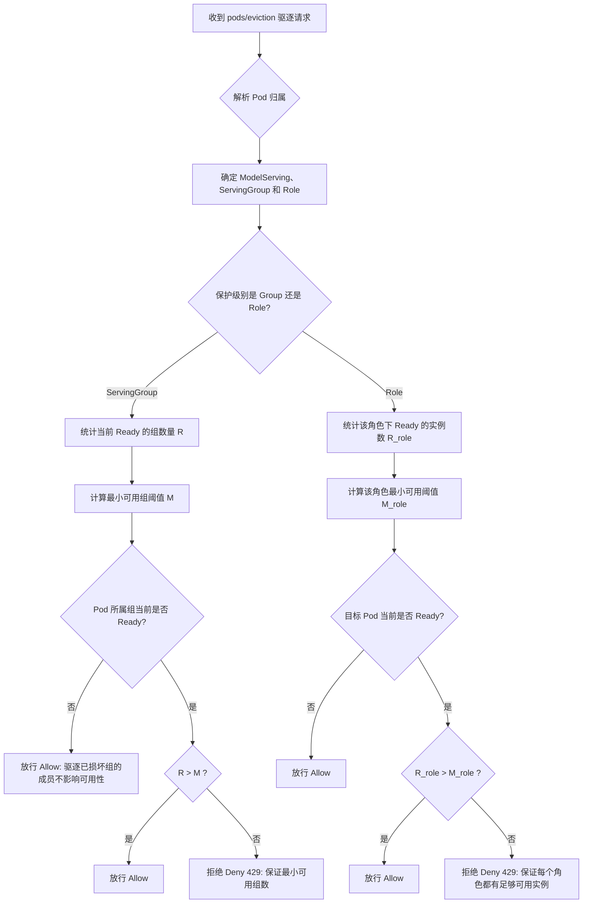

# 提案：基于逻辑阈值（minAvailable）的 ModelServing 推理组滚动保护设计

## 1. 背景与核心痛点
在复杂的 LLM 推理场景中，简单的“Pod 计数”式 PDB 无法表达组件间的逻辑关系。例如，驱逐一个推理组中的任一 Pod 都会导致整组失效。
用户需要一种符合 PDB 使用习惯（即支持 `minAvailable` 最小可用数），但能下钻到 **ServingGroup（推理组）** 或 **Role（角色）** 逻辑维度的保护机制。

## 2. 核心设计：逻辑准入保护 (Eviction Webhook)

我们将通过 Kthena Webhook 拦截 `pods/eviction` 请求，并根据用户定义的**保护级别**和**最小可用阈值**进行准入决策。

### 2.1 API 变更 (ModelServingSpec)
```go
type RolloutStrategy struct {
    // ...
    // EvictionStrategy 定义了节点驱逐期间的保护策略
    // +optional
    EvictionStrategy *EvictionStrategySpec `json:"evictionStrategy,omitempty"`
}

type EvictionStrategySpec struct {
    // 保护级别: ServingGroup (默认) 或 Role
    // - ServingGroup: 保证集群中处于 Ready 状态的推理组数量不低于阈值。
    // - Role: 保证每个角色（如 decode）处于 Ready 状态的实例数不低于阈值。
    // +kubebuilder:default=ServingGroup
    // +kubebuilder:validation:Enum={ServingGroup,Role}
    ProtectionLevel ProtectionLevelType `json:"protectionLevel"`

    // 最小可用数量 (可以是绝对值如 "3" 或百分比如 "80%")
    // +kubebuilder:default="1"
    MinAvailable *intstr.IntOrString `json:"minAvailable"`
}
```

### 2.2 决策逻辑流程



## 3. 场景推演：基于 MinAvailable 的组级保护

**【场景设定】**
*   **配置**：`ModelServing` 有 5 个推理组，`ProtectionLevel: ServingGroup`, `minAvailable: 3` (必须保住 3 个组)。
*   **物理分布**：
    *   **Node-A** 混部了 `Group-1` (3个Pod) 和 `Group-2` (3个Pod)。
    *   **Node-B** 及其他节点运行 `Group-3`, `Group-4`, `Group-5`。

**【执行 `kubectl drain Node-A`】**

| 步骤 | 操作事件 | 系统状态与 Webhook 反应 | 结果 |
| :--- | :--- | :--- | :--- |
| **1** | 驱逐 `G1-Pod-1` | 当前 Ready 组 = 5, 阈值 = 3。5 > 3，**放行**。 | `Group-1` 变为 NotReady。 |
| **2** | 驱逐 `G1-Pod-2` | 目标组 `Group-1` 已经是 NotReady。**放行**。 | `Group-1` 继续被清空。 |
| **3** | 驱逐 `G2-Pod-1` | 当前 Ready 组 = 4 (`G2,G3,G4,G5`)。4 > 3，**放行**。 | `Group-2` 变为 NotReady。 |
| **4** | 尝试驱逐 `G3-Pod-1` | 当前 Ready 组 = 3 (`G3,G4,G5`)。3 > 3 不成立！**拒绝**。 | `Node-B` 上的驱逐被挂起。 |
| **恢复期** | 控制器重建 | `Group-1` 在新节点 Ready。Ready 组恢复到 4。 | 预算恢复。 |
| **5** | 再次尝试 `G3` | 4 > 3，**放行**。 | 开启 `Group-3` 的迁移。 |

## 5. Webhook 核心部署配置

为了使该机制生效，需要在集群中配置 `ValidatingWebhookConfiguration`，精准拦截 `pods/eviction` 子资源。

### 5.1 ValidatingWebhookConfiguration
```yaml
apiVersion: admissionregistration.k8s.io/v1
kind: ValidatingWebhookConfiguration
metadata:
  name: kthena-eviction-webhook
webhooks:
  - name: eviction.modelserving.volcano.sh
    rules:
      - apiGroups: [""]
        apiVersions: ["v1"]
        operations: ["CREATE"]
        resources: ["pods/eviction"] # 核心：拦截驱逐子资源
        scope: "*"
    clientConfig:
      service:
        name: kthena-webhook-service
        namespace: kthena-system
        path: "/validate-eviction" # Webhook 逻辑路径
    admissionReviewVersions: ["v1"]
    sideEffects: None
    timeoutSeconds: 5
    failurePolicy: Fail # 生产环境建议 Fail，保证安全性
```

## 6. 实现阶段拆解
1.  **注册 Webhook**：在 Kthena 的 admission webhook server 中注册针对 `pods` 资源的 `eviction` 操作的 ValidatingWebhook。
2.  **状态查询器优化**：在 Webhook 逻辑中，需要能够快速根据 Pod 获取其所属 `ModelServing` 的实时健康状态（通过 Lister 缓存读取）。
3.  **并发锁设计**：由于 `kubectl drain` 是并发发起大量驱逐请求的，Webhook 需要保证“判定哪个组被允许驱逐”的逻辑是并发安全的。

