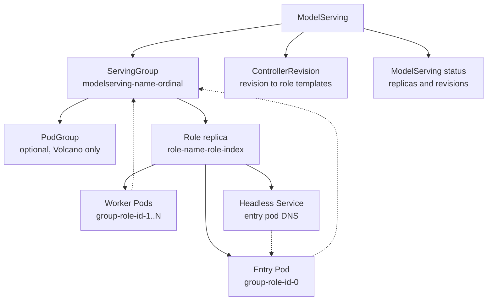
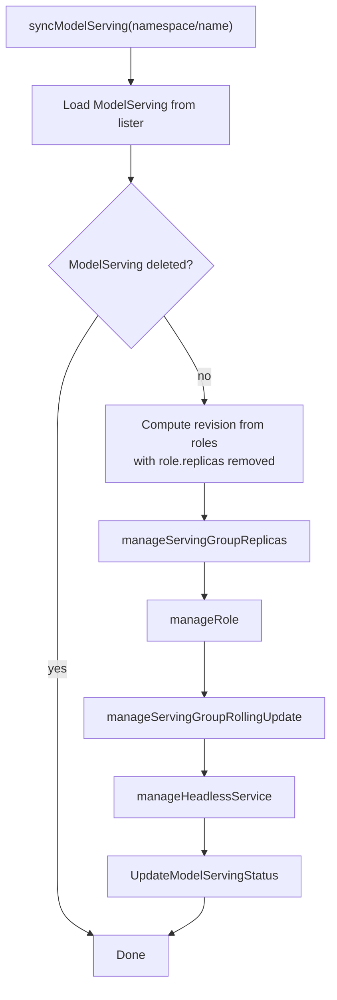
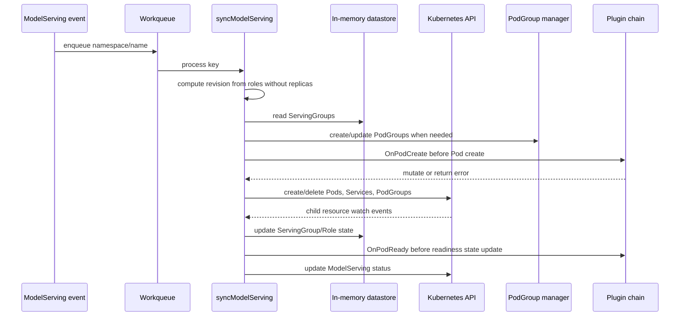
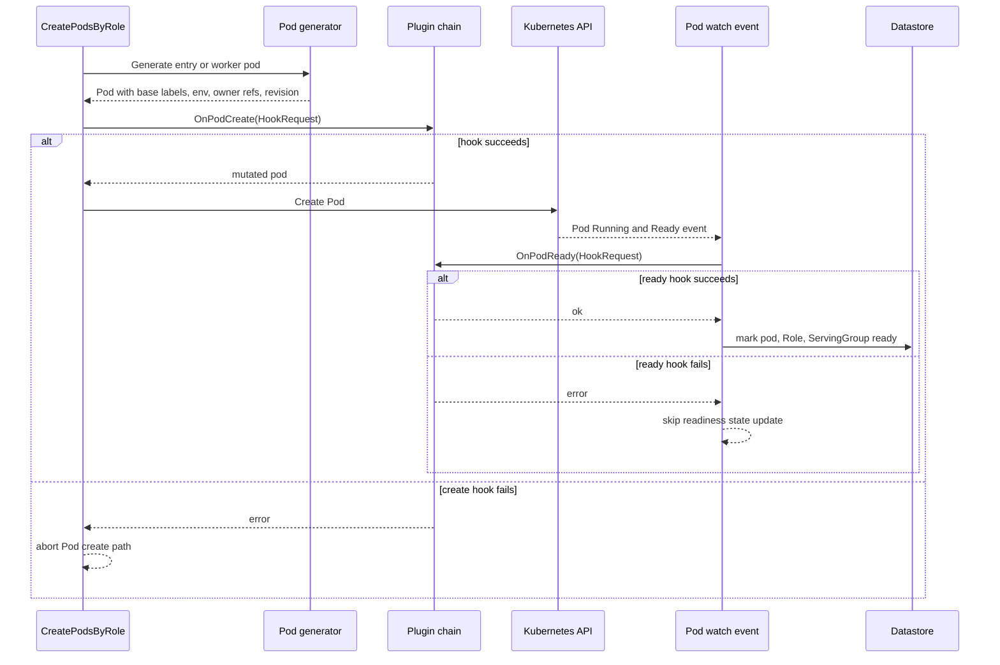
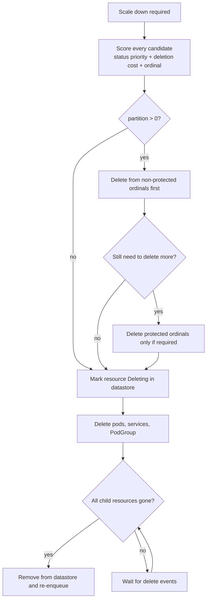
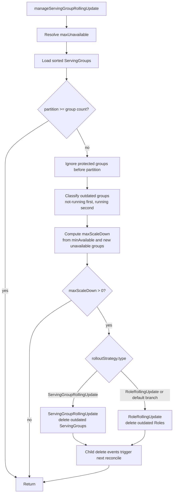
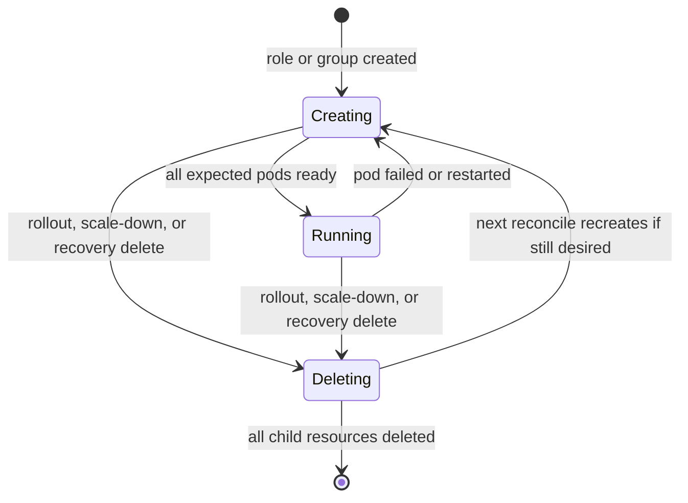

# ModelServing Controller Reconcile Flow

This document explains the current `ModelServing` controller implementation for
developers who need to read or change the component. It is a code-oriented
walkthrough, not an end-user API reference.

## Resource Model

A `ModelServing` describes a set of serving instances. In controller code, each
instance is called a `ServingGroup` and is named by ordinal:

```text
<modelserving-name>-<serving-group-ordinal>
```

Each `ServingGroup` contains one or more roles from
`spec.template.roles`. For each role replica, the controller creates:

- one entry pod;
- zero or more worker pods, according to `role.workerReplicas`;
- a headless Service for the entry pod when the role has workers;
- an optional Volcano PodGroup when the PodGroup CRD exists and
  `spec.schedulerName` is `volcano`.

The child resources are linked back to the parent and indexed by labels:

- `modelserving.volcano.sh/name`: owning `ModelServing` name;
- `modelserving.volcano.sh/group-name`: `ServingGroup` name;
- `modelserving.volcano.sh/role`: role name;
- `modelserving.volcano.sh/role-id`: role replica id, such as `prefill-0`;
- `modelserving.volcano.sh/revision`: ServingGroup template revision;
- `modelserving.volcano.sh/role-template-hash`: role template hash used by
  `RoleRollingUpdate`;
- `modelserving.volcano.sh/entry`: `true` on entry pods.

The public API pieces most relevant to reconcile are in
`pkg/apis/workload/v1alpha1/model_serving_types.go`: `spec.replicas`,
`spec.template.roles`, `spec.rolloutStrategy`, `spec.recoveryPolicy`, and
`status` fields such as `replicas`, `availableReplicas`, `updatedReplicas`,
`currentReplicas`, `currentRevision`, and `updateRevision`.



## Controller Entry Points

`NewModelServingController` in
`pkg/model-serving-controller/controller/model_serving_controller.go` wires the
runtime:

- `ModelServing` informer: add and spec-changing update events enqueue the
  `ModelServing`; delete events clear its in-memory state.
- Pod informer: add/update/delete events update in-memory state and can enqueue
  the parent `ModelServing`.
- Service informer: delete events enqueue the parent so headless Services can be
  recreated.
- PodGroup informer: if available, delete events enqueue the parent so PodGroups
  can be recreated.
- Pod and Service informers have indexers for group-level and role-level lookup:
  `GroupNameKey` and `RoleIDKey`.

`Run` starts informers, starts the PodGroup manager, waits for caches, calls
`syncAll`, and then starts workqueue workers. `syncAll` first replays existing
pods into the in-memory datastore, then enqueues existing `ModelServing`
objects. This is how controller process restarts rebuild runtime state.

## Main Reconcile Sequence

The workqueue handler calls `syncModelServing`. Its order matters:

1. Load the latest `ModelServing` from the lister.
2. Compute the ServingGroup revision from `spec.template.roles` after removing
   each role's `replicas`. Changing only role replica counts does not change the
   ServingGroup revision.
3. `manageServingGroupReplicas`: create or delete ServingGroups to match
   `spec.replicas`, and create/update PodGroups for non-deleting groups.
4. `manageRole`: for every non-deleting ServingGroup, create or delete role
   replicas to match the role template that should apply to that group.
5. `manageServingGroupRollingUpdate`: delete outdated ServingGroups or roles,
   limited by `maxUnavailable` and `partition`.
6. `manageHeadlessService`: ensure headless Services exist for non-deleting role
   replicas that have worker pods.
7. `UpdateModelServingStatus`: derive public status and clean up unused
   ControllerRevisions after revision fields move.





## In-Memory Datastore

`pkg/model-serving-controller/datastore/store.go` tracks controller-observed
runtime state. It is not the source of truth for Kubernetes objects; it is a
cached state machine rebuilt from informer events and reconcile actions.

For each `ModelServing`, the store keeps ServingGroups sorted by ordinal. Each
ServingGroup has:

- `Revision`: the ServingGroup template revision;
- `Status`: `Creating`, `Running`, `Deleting`, `Scaling`, or `NotFound`;
- running pod names;
- roles keyed by role name and role id.

Each Role has:

- `Revision`: the containing ServingGroup revision;
- `RoleTemplateHash`: the role-level template hash used by
  `RoleRollingUpdate`;
- `Status`: `Creating`, `Running`, `Deleting`, or `NotFound`.

Pod ready events add running pods and may move Role and ServingGroup status to
`Running`. Delete events remove running pods, complete pending deletions, and
enqueue the parent object when another reconcile pass is needed.

## Create And Scale Up

`manageServingGroupReplicas` compares the number of stored ServingGroups with
`spec.replicas`.

When scaling up, `scaleUpServingGroups` creates missing groups:

- With `partition > 0`, missing ordinals in `[0, partition)` are filled first.
  Those protected ordinals use `status.currentRevision` when available. If the
  matching ControllerRevision exists, its historical role template is used.
  Otherwise the current spec template is used, which is the expected first-start
  fallback.
- New ordinals after the current max ordinal use the newly computed revision and
  current `spec.template.roles`.
- A ControllerRevision is created for the new revision before creating new
  ServingGroups.

Creating a ServingGroup means:

1. create/update its PodGroup if gang scheduling is active;
2. call `CreatePodsForServingGroup`;
3. for each role replica, call `CreatePodsByRole`;
4. create entry and worker pods;
5. add the ServingGroup and Roles to the datastore as `Creating`.

Pod generation happens in `pkg/model-serving-controller/utils/utils.go`.
`GenerateEntryPod` and `GenerateWorkerPod` apply names, owner references,
labels, revision labels, role template hash labels, scheduler name, and common
environment variables before plugin hooks run.

## Plugin Hook Flow

Plugins are declared in `spec.plugins` and implemented under
`pkg/model-serving-controller/plugins`.

`buildPluginChain` constructs a chain from `ms.Spec.Plugins` using
`plugins.DefaultRegistry`. The chain preserves the order in `spec.plugins`. Only
the built-in plugin type is supported today; unknown plugin names or unsupported
types make chain construction fail.

The controller invokes two hooks:

- `OnPodCreate`: called inside `createPod` before the Pod is submitted to the
  Kubernetes API server. Plugins can mutate `req.Pod` in place or return an
  error. An error aborts that pod creation path.
- `OnPodReady`: called at the beginning of `handleReadyPod`, before the
  datastore records the pod as running and before Role or ServingGroup status is
  updated. An error aborts readiness handling for that event.

The hook request carries:

- `ModelServing`: the parent object;
- `ServingGroup`: the group name;
- `RoleName`: role name;
- `RoleID`: role replica id;
- `IsEntry`: whether the pod is an entry pod;
- `Pod`: the pod being created or observed ready.

Scope filtering happens before each hook call:

- empty scope means the plugin runs for all hooks;
- `scope.roles` restricts by role name;
- empty `scope.target` means all pod kinds;
- `scope.target=Entry`, `Worker`, or `All` filters by `IsEntry`.

Current built-in plugins:

- `demo-pod-tweaks`: on create, can set runtime class, append annotations, and
  append env vars to containers and init containers. Its ready hook is a no-op.
- `lws-standard-labels`: on create, when the `ModelServing` is owned by a
  `LeaderWorkerSet`, adds standard LWS set, group index, worker index, and group
  hash labels. Its ready hook is a no-op.

Because `OnPodCreate` runs after the controller has generated base labels and
before Kubernetes create, plugins see the final controller-generated pod shape
and can add metadata needed by integration layers. Because `OnPodReady` runs
before datastore readiness updates, a failing ready hook prevents that pod event
from advancing Role or ServingGroup readiness.



## Role Replica Management

`manageRole` loops through the sorted ServingGroups in the datastore and skips
groups marked `Deleting`.

For normal groups, it manages roles from the current spec and uses the newly
computed revision. For partition-protected groups, it resolves the group's
stored revision, falling back to `status.currentRevision`, and tries to load the
historical role template from ControllerRevision. That prevents protected groups
from being silently aligned to the latest role template.

`manageRoleReplicas` handles two levels of desired count:

- Role replica count: number of `Role` objects such as `prefill-0`,
  `prefill-1`;
- Pod count per role replica: one entry pod plus `workerReplicas` worker pods.

If a stored role has fewer pods than expected, the controller recreates missing
pods for that role. If there are fewer role replicas than desired,
`scaleUpRoles` creates new role ids with increasing indexes. If there are too
many, `scaleDownRoles` selects role ids to delete.

## Scale Down And Deletion Order

Scale-down selection is implemented in
`pkg/model-serving-controller/controller/binpack_scaledown.go`.

ServingGroup and Role scale-down use a priority tuple:

1. readiness/status priority: non-running resources are deleted before running
   resources;
2. pod deletion cost: lower total `controller.kubernetes.io/pod-deletion-cost`
   is deleted first;
3. ordinal/index: higher ordinal or role index is deleted first for backward
   compatibility.

ServingGroup scale-down also respects `partition`:

- non-protected groups, ordinals after the first `partition` groups, are deleted
  first;
- protected groups are deleted only if the desired replica count requires it
  after all non-protected groups are selected.

`deleteServingGroup` marks the group `Deleting`, deletes its PodGroup, deletes
all pods by group label, deletes group Services, and removes the group from the
store once all related resources are gone.

`DeleteRole` marks the role `Deleting`, deletes pods and Services by role id,
and removes the role from the store once all related resources are gone.

If a delete operation fails after the store status was changed, the controller
rolls the status back and re-enqueues the parent. Delete event handlers also
call `handleDeletionInProgress` to finish store cleanup when Kubernetes delete
events arrive asynchronously.



## Rolling Update

The controller supports two rollout strategies:

- `ServingGroupRollingUpdate`: update by deleting whole outdated ServingGroups.
- `RoleRollingUpdate`: update by deleting outdated roles inside each
  ServingGroup.

The revision used for ServingGroup comparison is calculated from
`spec.template.roles` with role replica counts removed. This means changing only
`role.replicas` scales roles but does not trigger a ServingGroup template
rollout.

The role template hash is calculated per role, also with `role.replicas`
removed. `RoleRollingUpdate` compares stored or inferred role template hashes
with the expected current hash.

`manageServingGroupRollingUpdate` performs the update gate:

1. compute `maxUnavailable`, defaulting to 1 and resolving percentages against
   `spec.replicas` with floor rounding;
2. get sorted ServingGroups from the store;
3. skip all groups before `partition`;
4. split outdated groups into non-running outdated groups and running outdated
   groups;
5. count unavailable groups already on the new revision;
6. calculate `minAvailable = spec.replicas - maxUnavailable`;
7. calculate how many outdated groups can be deleted without exceeding
   availability limits;
8. delete outdated resources according to the selected rollout strategy.

For `ServingGroupRollingUpdate`, deleting an outdated group lets the next
reconcile create a replacement at a newer ordinal or fill a missing ordinal with
the appropriate revision.

For `RoleRollingUpdate`, `findOutdatedRolesInServingGroups` compares each
stored role type against the new role templates. It also treats roles that exist
in the store but no longer exist in the spec as outdated. If a ServingGroup has
no outdated roles, its stored revision is updated to the new revision.



## Partition And ControllerRevision

`partition` protects lower ordinals from rollout. For example, with
`replicas=5` and `partition=2`, ordinals `0` and `1` stay on their existing
revision while ordinals `2` through `4` are eligible for update.

The controller uses Kubernetes `ControllerRevision` objects to preserve role
templates for revisions that may be needed later:

- `scaleUpServingGroups` creates a ControllerRevision for newly created groups
  on the new revision.
- When deleting a partition-protected group, `deleteServingGroup` creates a
  ControllerRevision for that group's stored revision before deletion. This lets
  the controller recover the protected ordinal using the historical template.
- `manageRole` and partition-aware scale up read ControllerRevision data to
  obtain old role templates.
- `UpdateModelServingStatus` preserves `status.currentRevision` and
  `status.updateRevision`, then `CleanupOldControllerRevisions` removes
  revisions that are neither current nor update.

`status.updateRevision` is always the revision currently being applied.
`status.currentRevision` is kept as the previous revision while any non-updated
groups still use it; when all groups are updated, it becomes equal to
`updateRevision`.

## PodGroup Flow

PodGroup integration lives in
`pkg/model-serving-controller/podgroupmanager/manager.go`.

The manager watches the PodGroup CRD. If the CRD is absent, PodGroup handling is
disabled and reconcile proceeds without gang scheduling objects. If present,
the manager initializes a PodGroup informer with the same group-name index used
by the controller.

`CreateOrUpdatePodGroup` runs only when `spec.schedulerName` is `volcano`. It
creates or updates a PodGroup for each non-deleting ServingGroup. PodGroup spec
is derived from the ModelServing template:

- `minMember`: total pods in one ServingGroup;
- `minResources`: aggregated resource requests;
- optional queue from the ModelServing queue annotation;
- optional network topology policy;
- optional subgroup policy when the installed PodGroup CRD supports it.

Pods are annotated with their PodGroup through `AnnotatePodWithPodGroup` during
`CreatePodsByRole`, before plugin `OnPodCreate`.

If PodGroup creation returns a retry duration, the controller re-enqueues the
ModelServing after that duration and treats the current reconcile path as
successfully deferred.

## Failure And Recovery

Pod update events are handled by `updatePod`.

When a pod is running and ready:

1. plugin `OnPodReady` runs;
2. the pod is added to the datastore as running;
3. `checkRoleReady` moves the Role to `Running` when all pods in that role id
   are ready;
4. `checkServingGroupReady` moves the ServingGroup to `Running` when all roles
   match expected replica counts and are running;
5. the parent `ModelServing` is re-enqueued when a ServingGroup becomes ready,
   which allows rolling update to make another step.

When a pod fails or any container restarts:

1. the pod is put into a grace map so repeated events do not trigger duplicate
   handling;
2. the pod is removed from the running-pod set;
3. a running Role is moved back to `Creating`;
4. a running ServingGroup is moved back to `Creating`;
5. after `restartGracePeriodSeconds`, the pod is deleted if it did not recover;
6. if no grace period is configured, deletion happens immediately.

When the delete event arrives, `handleDeletedPod` applies
`spec.recoveryPolicy`:

- `ServingGroupRecreate`: delete the entire ServingGroup.
- `RoleRecreate`: delete the affected role. If the ServingGroup is already
  deleting, continue deleting the group instead.
- `None`: no explicit recovery action in the current switch.

Delete events from Services and PodGroups follow the same parent lookup,
ownership check, deletion-in-progress completion check, and re-enqueue pattern.



## Headless Services

`manageHeadlessService` runs after replica and rollout management. It skips
ServingGroups and Roles marked `Deleting`. For each remaining role replica, if
the role has `workerTemplate`, it ensures a headless Service exists for the
entry pod.

The service selector targets one entry pod by group, role, role id, and
`entry=true`. The service name matches the entry pod name. This gives worker
pods a stable DNS target through the `ENTRY_ADDRESS` env var.

If an existing Service with the target name is not owned by the current
ModelServing UID, the controller re-enqueues after one second instead of
claiming it. This avoids conflicts with leftovers from a deleted same-named
ModelServing.

## Status Calculation

`UpdateModelServingStatus` is conflict-retried and recalculates status from the
latest lister object plus datastore state.

For each non-deleting ServingGroup:

- `availableReplicas` increments when the group is `Running`, or when
  `checkServingGroupReady` confirms it can be moved to `Running`;
- `updatedReplicas` increments when group revision equals the newly computed
  revision;
- `currentReplicas` increments for groups still on another revision;
- progressing, updated, and current group indexes are collected for conditions.

Conditions are set by `utils.SetCondition`:

- `Available=True` when no groups are progressing;
- `UpdateInProgress=True` when some groups are progressing and current groups
  remain beyond `partition`;
- otherwise `Progressing=True` when groups are still creating, scaling, or
  deleting.

`status.labelSelector` is set for the scale subresource. It intentionally
selects exactly one pod per ServingGroup: entry pod, first role, role id
`<first-role>-0`. This keeps HPA or KEDA from interpreting multiple pods inside
one ServingGroup as multiple `ModelServing` replicas.

If no groups exist, status still records `currentRevision`, `updateRevision`,
and `labelSelector` so the object has stable rollout and scale metadata before
ServingGroups appear.

## Change Guide

Start with these files for common changes:

- Main reconcile order, event handling, recovery, rollout, status:
  `pkg/model-serving-controller/controller/model_serving_controller.go`.
- Scale-down priority and pod deletion cost:
  `pkg/model-serving-controller/controller/binpack_scaledown.go`.
- Runtime state shape:
  `pkg/model-serving-controller/datastore/store.go`.
- Revision history:
  `pkg/model-serving-controller/utils/controller_revision.go` and
  `pkg/model-serving-controller/utils/revision_util.go`.
- Child object names, labels, pod generation, conditions, `maxUnavailable`:
  `pkg/model-serving-controller/utils/utils.go`.
- Public rollout and status API:
  `pkg/apis/workload/v1alpha1/model_serving_types.go`.
- PodGroup behavior:
  `pkg/model-serving-controller/podgroupmanager/manager.go`.
- Plugin chain and built-ins:
  `pkg/model-serving-controller/plugins`.

Before changing rollout, partition, recovery, or deletion behavior, read the
controller tests in `pkg/model-serving-controller/controller/*_test.go`. They
cover partition handling, ControllerRevision alignment, role-level update,
scale-down ordering, and delete/recreate state transitions.
